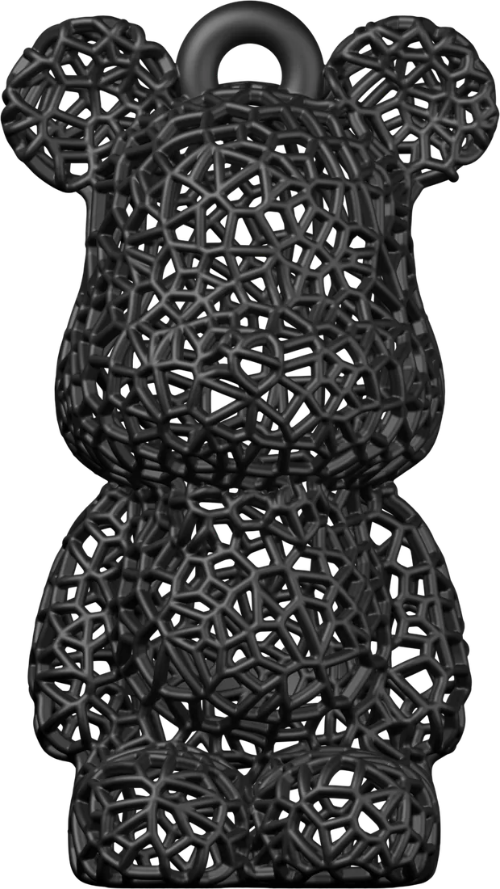
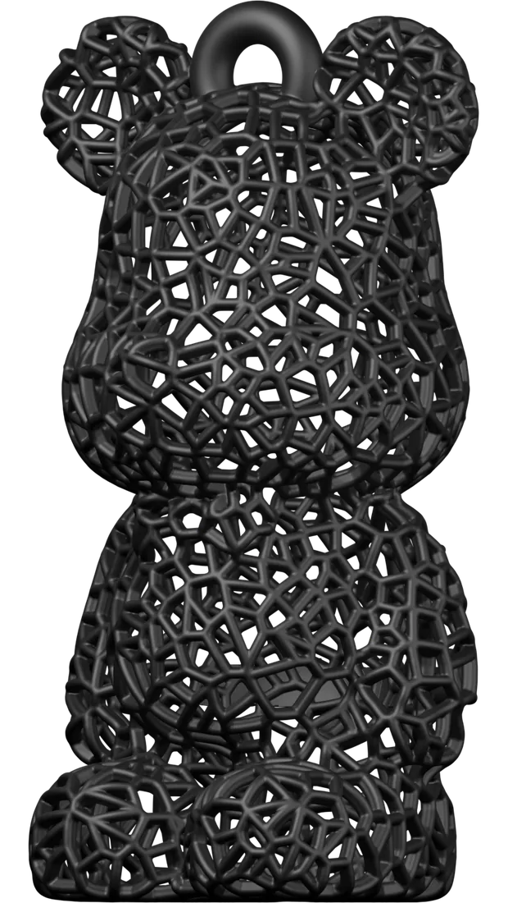
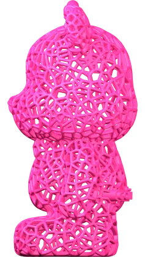
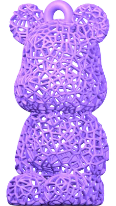
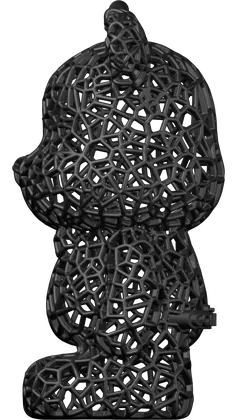
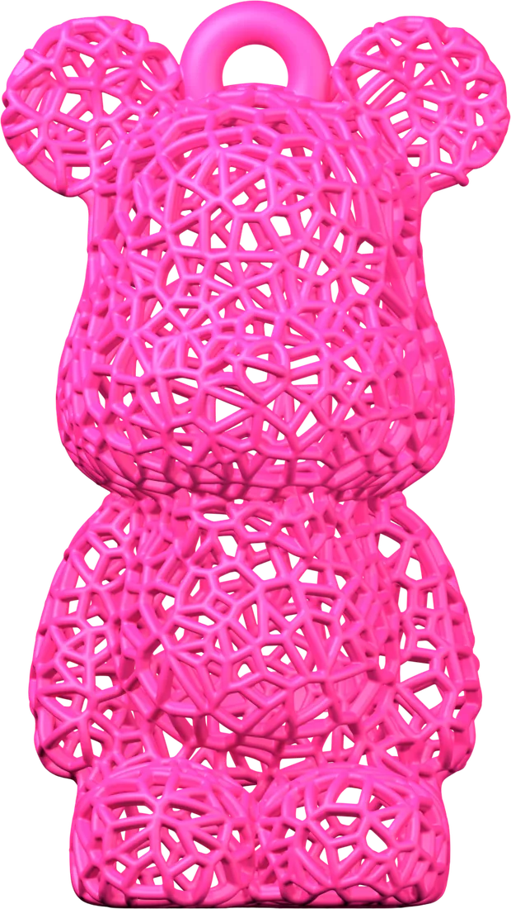
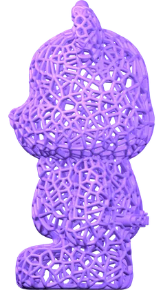
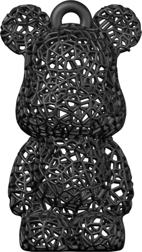
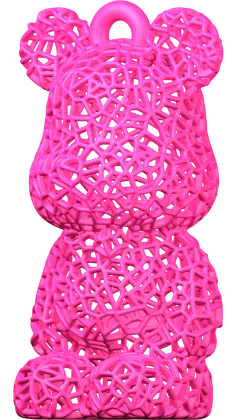
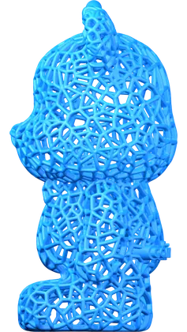

# 래티스 곰돌이 키링 — 반응형 랜딩 키트

3페이지(랜딩·상품·체크아웃) 반응형 사이트를 **다른 무드로 다시 만들기 위한 인수인계 문서**다.
레이아웃·컴포넌트·이미지 파이프라인·3D 원본 정보가 전부 들어 있고,
**무드(색·톤·카피·명칭 체계)만 일부러 비워 뒀다.**

---

## 0. 쓰는 법

새 채팅 첫 메시지에 이 파일을 첨부하고 아래처럼 지시한다.

> 이 키트대로 반응형 랜딩페이지를 만들어줘. 무드는 **______** 로 간다.
> 작업 폴더는 `______` 이고, 3D 원본과 Blender 경로는 문서에 적힌 그대로다.

§10에 CSS·JS·Blender 스크립트 **전문**이 들어 있으므로, 새 폴더에서 처음부터 시작해도 된다.

### 지금 이 폴더에 올라가 있는 무드 — MILK LAB (코스메틱 클린·퓨어·큐트)

| 항목 | 값 |
|---|---|
| 배경 | 밀키 아이보리 `#FBF7F4` / 면 `#FFFFFF` / 푸터 `#F6EFEA` |
| 액센트 | 블러시 `#FF9EB5`(면·테두리) + `#C4405F`(글자용, 본문 대비 4.6:1) |
| 제품 컬러 | 파스텔 8셰이드 — GREY/BLUSH/PEACH/BUTTER/MINT/SKY/LILAC/ROSE |
| 명칭 체계 | `MOOD` → **`SHADE`**, 서브라벨은 마감 표현(MISTY·DEWY·GLOW·SOFT·FRESH·CLEAR·AIRY·TINT) |
| 히어로 카피 | "Find your / **soft shade.**" |
| 폰트 | Poppins(디스플레이) + DM Sans(본문) + DM Mono(마이크로 라벨) |
| 드롭 넘버 | `DROP 001` → `EDITION 01` |
| 그 외 | 라운드 토큰(`--r-*`) 도입, 디스플레이 제목은 대문자 변환 없음, 마이크로 라벨만 모노+대문자 유지 |

아래 §1~§10 은 **직전 다크·핑크 무드 기준**으로 쓰인 원본 인수인계 문서다.
구조·파이프라인 설명은 그대로 유효하고, 색·폰트·카피만 위 표로 교체되어 있다.

---

## 1. 새 채팅에서 정해야 할 것 — 이 문서에 일부러 뺀 것

| 항목 | 지금 사이트 | 새 무드에서 |
|---|---|---|
| 액센트 컬러 | 핑크 1색 | ? |
| 배경 톤 | 거의 검정 다크 | ? |
| 제품 컬러 세트 | 8색 | 몇 색? 어떤 색? |
| 컬렉션 명칭 체계 | `MOOD` (CHILL·HEAT·…) | 다른 단어 체계 |
| 히어로 카피 | 2줄, 둘째 줄 액센트 | ? |
| 폰트 페어링 | Space Grotesk + JetBrains Mono | ? |
| 저널 카드 3개 문구 | 드롭/제작기/착용컷 | ? |
| 드롭 넘버 | `DROP 001` | ? |

**컬러 세트를 정하면 두 곳에 같은 값을 넣어야 한다** — `assets/js/caribear-site.js`의 `COLORS`와
`tools/blender_render_bear.py`의 `PRODUCT`. 둘이 어긋나면 사이트 칩 색과 렌더 색이 달라진다.

---

## 2. 변하지 않는 것 — 제품

- **제품**: 보로노이 오픈 래티스 곰돌이 키링
- **스펙 시트**: TPE SILICONE / VORONOI LATTICE / STAINLESS 316L RING / MADE IN KOREA

### 카테고리 3종 (2026-09-02 추가)

| 카테고리 | 치수 | 가격 | 이미지 |
|---|---|---|---|
| BASIC 키링 | 65×65×95MM · 42G | ₩38,000 (정가 ₩45,000) | `bear-<shade>*.webp` |
| MINI 키링 | 40×40×58MM · 12G | ₩24,000 | `lineup-size.webp` (비교컷) |
| STICKER 팩 | 6매 · 50×70MM · 방수 비닐 | ₩9,000 | `sticker-sheet.webp` |

> ⚠️ **BASIC 외의 치수·무게·가격, 스티커 사양은 전부 자리값이다.** 확정되면
> `assets/js/caribear-site.js` 의 `SIZES` 와 `index.html` 라인업 섹션 카피를 고친다.
> 스티커는 실제 아트웍이 없어서 기존 렌더로 다이컷 모양을 만들어 쓴 것이다.

**MINI 는 따로 렌더하지 않는다.** 카메라가 오소라서 균등 배율 축소 = 이미지 축소와
픽셀 단위로 같다. `tools/make_lineup_art.py` 가 기존 렌더를 62%로 줄여 비교컷을 만든다.
- **형태**: 크고 둥근 귀 2개, 정수리 중앙 키링 고리, 팔·다리 분리, 폭:높이 ≈ 1:1.75

### 3D 원본 (모두 `C:\Users\carima\Desktop\작업\ETC\곰돌이 키링\`)

| 파일 | 정체 | 크기 |
|---|---|---|
| `곰돌이키링_테스트출력.obj` | **래티스 판. 사이트가 쓰는 것** | 460MB · 5M verts · 10M polys |
| `곰돌이키링.obj` | 솔리드 판. **코와 나비넥타이가 있다** (래티스 판엔 없음) | 32MB · 158k verts |
| `곰돌리이잉.png` | 솔리드 판 정면 렌더. 형태 확인용 참고 이미지 | 4MB |

래티스 판은 Blender 임포트 15초, RAM 3GB 여유로도 돌아간다. 겁먹지 말 것.

---

## 3. 파일 구조

```
웹사이트/
├─ index.html              랜딩
├─ keyring-basic.html      상품 상세 — BASIC 키링
├─ keyring-mini.html       상품 상세 — MINI 키링
├─ sticker.html            상품 상세 — 다이컷 스티커 팩
├─ checkout.html           체크아웃
├─ LANDING_KIT.md          이 문서
├─ .claude/launch.json     로컬 서버 설정
├─ assets/
│  ├─ css/
│  │  ├─ caribear.css        토큰·그리드·내비·버튼·푸터   (139줄)
│  │  └─ caribear-pages.css  페이지별 레이아웃            (318줄)
│  ├─ js/
│  │  ├─ caribear-site.js    셰이드·사이즈 정본 · 내비 토글 · 이미지 경로
│  │  └─ caribear-pdp.js     키링 상세 공통 동작 (basic·mini 가 공유)
│  ├─ img/
│  │  ├─ bear-<shade>[-angle].webp      큰 컷 620×1100 · ~150KB
│  │  ├─ sm/bear-<shade>[-angle].webp   작은 컷 237×420 · ~40KB
│  │  ├─ lineup-size.webp               BASIC+MINI 크기 비교컷
│  │  ├─ sticker-sheet.webp             다이컷 스티커 6종
│  │  ├─ sticker-<shade>.webp           스티커 낱장
│  │  └─ _render/                       Blender 원본 PNG (서빙 안 함, 지워도 됨)
│  └─ video/
│     └─ bear-blush-turntable.webm      히어로 턴테이블 (VP9+알파, 406×720, ~1.9MB)
└─ tools/
   ├─ blender_render_bear.py  3D → 32컷 PNG
   ├─ optimize_shots.py       PNG → WebP 2사이즈
   ├─ blender_turntable.py    3D → 턴테이블 PNG 시퀀스
   ├─ encode_turntable.py     시퀀스 → 투명 WebM
   └─ make_lineup_art.py      렌더 → 크기 비교컷 · 다이컷 스티커
```

CSS 2장, JS 1장. 빌드 도구 없음. 그냥 정적 파일이다.

---

## 4. 페이지 구성

### 4.1 랜딩 `index.html`

```
NAV (sticky)
  로고 · 중앙 링크 4개(구분점) · 우측 아이콘 3개(검색/계정/카트)
  1023px 이하 → 햄버거, 링크는 드로어로

HERO
  좌: H1 2줄(둘째 줄 액센트) / 모노 메타 1줄 / 버튼 2개(솔리드+아웃라인)
  우: 제품컷 1장
  배경: 액센트 글로우 + 원근 그리드 바닥(rotateX 58deg, 위로 페이드)
  1023px 이하 → 제품컷이 카피 위로 올라감(order:-1)

라인업 (BASIC / MINI / STICKER)   ← 카테고리 3종
  카드 3장. 각 카드가 개별 상세페이지로 들어가는 입구다.
  1열(모바일) → 2열(640px) → 3열(1000px)

컬러 그리드   ← 지금은 "8 SHADES. 1 SHAPE."
  섹션 타이틀 + 원형 디스크 N개
  디스크 안에 컬러별 제품컷, 아래 2줄 라벨(번호+이름 / 서브라벨)
  2열(모바일) → 4열(520px) → N열(1024px)

대표 상품
  좌우 2분할. 좌: 정사각 제품컷 / 우: 배지·H2 3줄·설명 2줄·가격·CTA·USP 3칸
  899px 이하 → 세로 적층

저널
  3열 카드. 각 카드: 16:10 그룹컷 + 날짜 + 제목 + 2줄 발췌 + READ MORE
  699px 이하 → 1열

푸터
  거대 워드마크 + 4열 링크 + 하단 카피라이트
```

### 4.1-B 라인업 → 개별 상세페이지 (2026-09-02 구조 변경)

랜딩에는 제품 블록을 **깔지 않는다**. 카드 3장이 입구이고, 내용은 각 페이지가 갖는다.

```
index.html #lineup      카드 3장 (이미지·카테고리·이름·스펙·가격·VIEW DETAILS)
   ├─ keyring-basic.html   BASIC 키링 상세
   ├─ keyring-mini.html    MINI 키링 상세 (+ 크기 비교 그림)
   └─ sticker.html         스티커 팩 상세
```

**키링 두 페이지는 마크업만 따로고 동작은 `assets/js/caribear-pdp.js` 하나를 공유한다.**
각 페이지 끝에서 `CARIBEAR.initPDP({ size: 'basic' })` 로 자기 사이즈만 알려 준다.
가격·치수는 JS 가 아니라 **HTML 에 박아 둔다** — 스크립트가 죽어도 맞는 값이 보인다.

사이즈 칩(BASIC/MINI)은 상태 토글이 아니라 **다른 페이지로 가는 링크**이고,
고른 셰이드를 `?color=` 로 들고 넘어간다. 스티커는 세트 상품이라 스와치(선택) 대신
칩(구성 안내)을 쓰고, 각도 4컷 대신 세트컷 + 낱장컷을 건다.

### 4.2 상품 상세 `keyring-basic.html` / `keyring-mini.html`

```
NAV (로고 액센트색 변형) → 빵부스러기 4단계(마지막 = 선택 컬러)

PDP 2열
  좌: 정사각 메인컷 + 썸네일 4컷(정면/3-4/측면/뒷면)
  우: 아이브로우 · H1 · 변형표기 · 가격(현재+취소선) · 별점
      컬러 스와치(원형 N개) · 수량 스테퍼 · CTA 2개 · 신뢰 아이콘 3칸
  899px 이하 → 세로 적층, 899px 이상에서 우측 sticky(top:88px)

스펙 박스
  아이콘+2줄 설명 3칸 → 구분선 → SPEC SHEET 표 4행

연관 상품   4열 카드(2열 @ 모바일)
리뷰        2열 카드 + VIEW ALL 링크
푸터        4열 링크 + 소셜 아이콘 + 워드마크
```

**스와치와 썸네일은 독립적으로 조합된다.** 측면을 고른 뒤 색을 바꾸면 그 색의 측면이 나온다.
컬러 선택은 URL `?color=<key>`에 반영되고 새로고침해도 유지된다.
사이즈는 URL 파라미터가 아니라 **페이지 자체**가 들고 있다.

### 4.3 체크아웃 `checkout.html`

```
헤더: 로고 · 단계 표시(CART → CHECKOUT ● → CONFIRMATION) · HELP
H1 CHECKOUT

2열 (999px 이하 세로 적층)
좌: 번호 뱃지가 붙은 3스텝
    1 CONTACT   이메일 + 구독 체크박스
    2 DELIVERY  이름/주소1/주소2/도시+우편번호/국가 select/전화
                + 배송수단 라디오 카드 2개(가격 다름)
    3 PAYMENT   결제수단 라디오 4개 + 카드번호/유효기간/CVC
    PLACE ORDER 버튼(총액 표시) + 데모 안내문
우: 테두리 있는 주문 요약 (999px 이상 sticky)
    라인아이템 3개(썸네일+옵션+수량+금액) → 소계/배송비/할인 → TOTAL
    → 프로모션 코드 입력 → 혜택 2줄
```

**동작**: 배송수단 전환 → 합계 재계산, 프로모션 코드 적용, 카드번호·유효기간 입력 포맷.
**폼은 어디로도 전송되지 않는다.** submit은 `preventDefault`로 막고 안내문만 바꾼다.
카드 입력란은 포맷팅만 하고 저장·전송하지 않는다. 실결제는 PG 연동 시 iframe/SDK로 교체해야 한다.

---

## 5. 디자인 시스템

### 반응형 그리드 (4 / 8 / 12)

| 브레이크포인트 | 컬럼 | 거터 | 좌우 여백 | 최대폭 |
|---|---|---|---|---|
| 기본 | 4 | 16px | 20px | 100% |
| ≥768px | 8 | 20px | 40px | 100% |
| ≥1200px | 12 | 24px | 48px | 100% |
| ≥1440px | 12 | 24px | 84px | 1272px |

`.wrap`이 좌우 여백과 최대폭을, `.grid`가 컬럼을 담당한다.

### 타입 스케일

```
--fs-display-1  clamp(2.75rem, 1.1rem + 7.4vw, 6.5rem)   히어로 H1 / 체크아웃 H1
--fs-display-2  clamp(2rem, 1.2rem + 3.4vw, 3.5rem)      섹션 타이틀
--fs-body       .9375rem     --fs-caption .8125rem     --fs-meta .75rem
--ls-logo -.03em   --ls-tight -.025em   --ls-meta .14em (모노 라벨용)
```

작은 라벨은 전부 **모노 + 대문자 + 자간 .14em**. 이게 이 사이트 톤의 절반이다.

### 무드 교체 지점 — 여기만 바꾸면 된다

| 위치 | 내용 |
|---|---|
| `caribear.css` 6~21행 | 팔레트 전체(`--pink-*`, `--ink-*`, `--accent`, `--bg`, `--text`) |
| `caribear.css` 28~30행 | 폰트 스택 3종 |
| `caribear-pages.css` 8·64·127·283행 | 제품컷 배경 그라디언트 / 디스크 배경 / 썸네일 배경 |
| `caribear-pages.css` 10·14·26·30·31·65·263행 | 하드코딩된 `rgba(255,46,136,…)` — 액센트 글로우·그리드 바닥·드롭섀도 |
| `caribear-site.js` `COLORS` 배열 | 제품 컬러 키·번호·이름·서브라벨·칩색·림색 |
| `blender_render_bear.py` `PRODUCT` dict | 렌더용 컬러 (위와 같은 값이어야 함) |
| 각 HTML | 카피 전부 |

~~새 무드에서는 `caribear-pages.css`의 하드코딩된 rgba를 `--accent-rgb` 같은 토큰으로
빼놓는 게 낫다.~~ → **MILK LAB 에서 처리 완료.** 글로우·바닥 그리드는 전부
`rgba(var(--accent-rgb),…)` 를 쓰고, 액센트를 바꾸려면 `caribear.css` 의
`--accent-rgb` 한 줄만 고치면 된다.

---

## 6. 컴포넌트 인벤토리

```
레이아웃   .wrap .grid .section .section__title .section__bar .eyebrow .mono .sr
내비       .nav .nav__in .nav__links .nav__right .nav__toggle .wordmark .steps .crumbs
버튼       .btn (--primary --ghost --outline --block --lg) .more .badge
제품컷     .shot .shot--group .bear
히어로     .hero__bg .hero__glow .hero__floor .hero__in .hero__stage .hero__cta .hero__meta
컬러그리드 .moods .moods__head .mood .mood__disc .mood__name .mood__mood
대표상품   .feature .feature__shot .feature__body .price .usp
저널       .journal .post .post__shot
PDP        .pdp .pdp__info .pdp__variant .gallery__main .gallery__thumbs .thumb
           .price-row .price-was .rating .stars .swatches .swatch .qty
           .trust .specs .specs__strip .cards .card .reviews .review .tag .tags
체크아웃   .checkout .step .step__head .step__n .field .field-row .input .check
           .opts .opt .opt__txt .pay-mark .summary .line .totals .grand .promo .perks
푸터       .footer .footer__cols .footer__mark .footer__base .social .mini-footer .note
```

---

## 7. 이미지 파이프라인 — 3D 원본 → 웹

두 단계다. 사진을 찍거나 누끼를 딸 필요가 없다.

```bash
"C:/Program Files/Blender Foundation/Blender 5.2/blender.exe" -b -P tools/blender_render_bear.py -- \
  --obj "C:/Users/carima/Desktop/작업/ETC/곰돌이 키링/곰돌이키링_테스트출력.obj" \
  --out assets/img --colors grey,blush,peach,butter,mint,sky,lilac,rose \
  --angles front,three,side,back --res 900 --samples 128 --margin 1.16 --flip --yaw0 0
```

```bash
python tools/optimize_shots.py
```

- 32컷(8색 × 4각도) 렌더에 **약 4분**, 최적화 30초
- PNG 46MB → WebP **4.9MB**(큰 컷) + **1.4MB**(작은 컷)
- 필요 라이브러리: `Pillow`, `numpy` (일반 Python 쪽. Blender는 자체 내장 사용)

### 반드시 지킬 것 — 안 지키면 반드시 틀린다

1. **`--flip` 없으면 모델이 거꾸로 들어온다.** Rhino OBJ라 위아래가 뒤집혀 있다.
   뒤집힌 걸 알아보는 법: 가장 넓은 부분(귀)이 아래로 가고, 코가 나비넥타이 아래로 간다.
2. **`--flip`과 `--yaw0 0`은 세트다.** flip이 yaw 방향을 뒤집으므로 둘을 따로 바꾸지 말 것.
3. **검정 베이스 컬러를 밝게 띄우지 말 것.** 다크 배경에서 안 보일까 봐 0.02로 올렸더니
   실버처럼 보였다. 정본 값 그대로 두면 스튜디오 림 라이트(스페큘러)가 형태를 살린다.
4. **카메라는 오소(ORTHO).** 원근을 넣으면 각도마다 형태가 달라 보인다.
   모든 컷이 같은 카메라·같은 조명이어야 색끼리 안 튄다.
5. **`optimize_shots.py`는 32컷 전체를 한 번에 돌려야 한다.** 일부만 다시 뽑아 돌리면
   공통 캔버스 크기가 달라져서 그 색만 크기가 튄다.

### 이미지 슬롯 규격

| 슬롯 | 파일 | 표시 높이 |
|---|---|---|
| 히어로 | `bear-<c>.webp` (큰 컷) | ~530px @1x |
| 대표 상품컷 | `bear-<c>-three.webp` | ~440px |
| PDP 메인 | `bear-<c>[-angle].webp` | ~450px |
| 저널 그룹컷 | 큰 컷 + `sm/` 혼합, CSS로 겹쳐 배치 | 가변 |
| 컬러 디스크 | `sm/bear-<c>.webp` | ~126px |
| PDP 썸네일 | `sm/bear-<c>[-angle].webp` | ~90px |
| 연관 상품 카드 | `sm/bear-<c>-three.webp` | ~180px |
| 카트 라인 | `sm/bear-<c>[-angle].webp` | ~90px |

경로는 반드시 `CARIBEAR.shot(key, angle, small)`로만 만든다. 문자열을 직접 조립하지 말 것.

### 저널 그룹컷 배치법

낱장 누끼를 CSS로 겹친다. 컨테이너에 `.shot--group`, 각 이미지에 인라인 변수:

```html


```

`--x`는 가로 중심, `--h`는 컨테이너 대비 높이. 바닥 정렬이라 자연스럽게 원근이 생긴다.

---

## 7-B. 히어로 턴테이블 영상

랜딩 히어로의 곰은 **정지 이미지가 아니라 한 바퀴 도는 루프**다 (MILK LAB 무드에서 추가).
§9 의 "정적으로 만든다" 원칙에 대한 **범위를 좁힌 예외 하나**다 — 드래그 회전·커서
스퀴시·스크롤 리빌은 여전히 없고, 히어로 한 곳만 자동 회전한다.

```bash
# 1) 프레임 96장 (Blender 5.2 빌드에 FFMPEG 이 없어서 PNG 로만 뽑는다)
"C:/Program Files/Blender Foundation/Blender 5.2/blender.exe" -b -P tools/blender_turntable.py --   --obj "C:/Users/carima/Desktop/작업/ETC/곰돌이 키링/곰돌이키링_테스트출력.obj"   --out <임시폴더> --color blush --frames 96 --fps 24 --res 900 --samples 24 --png-frames

# 2) 투명 WebM 인코딩 (ffmpeg 는 imageio_ffmpeg 안의 것을 쓴다)
python tools/encode_turntable.py <임시폴더> --color blush --height 720 --crf 48
```

렌더 4분 + 인코딩 1분. 결과 406×720 · 4초 루프 · **약 1.9MB**.

### 지켜야 할 것

1. **조명·카메라·재질은 정지컷과 같은 값이어야 한다.** 두 스크립트에 같은 값이 중복으로
   들어 있다 (key 380 / fill 240 / rim 190 / under 110, ORTHO, margin 1.16).
   한쪽만 고치면 poster 에서 영상으로 갈아탈 때 톤이 튄다.
2. **모든 프레임을 같은 사각형으로 자른다.** `optimize_shots.py` 처럼 프레임마다 알파
   박스를 재서 자르면 실루엣 변화 때문에 곰이 위아래로 떤다. `encode_turntable.py` 는
   전 프레임 합집합 박스 하나로만 자른다. 지금 그 박스가 정지컷 공통 캔버스와 똑같은
   832×1476 이라, poster ↔ 영상 전환이 이음매 없이 붙는다.
3. **마지막 프레임에 360도를 넣지 않는다.** 0도와 겹쳐서 루프가 한 프레임 멈칫한다.
4. **회전 보간은 LINEAR.** 기본 BEZIER 이징이 붙으면 루프 이음매에서 속도가 튄다.
   Blender 5 는 `action.fcurves` 가 없어졌으므로, 키를 꽂기 **전에**
   `preferences.edit.keyframe_new_interpolation_type = 'LINEAR'` 로 바꾼다.

### 페이지 쪽 규칙 (`index.html`)

- `<video>` 의 `poster` 는 **같은 셰이드의 정지컷**(`bear-blush.webp`) = 0도 프레임이다.
- **아무 데서나 받지 않는다.** 저모션 설정 / 1023px 이하 / 데이터 절약 모드에서는
  `src` 를 아예 붙이지 않고 poster 정지컷으로 둔다. 원래 이 사이트의 기본 디자인이
  정지컷이라, 폴백이 곧 원안이다.
- **투명 WebM 은 Chrome/Firefox/Edge 만 재생한다.** Safari 는 poster 로 떨어진다.
  알파를 포기하고 배경을 구워 넣으면 히어로 그라디언트 위에서 사각형이 보이므로,
  Safari 는 정지컷으로 두는 편이 낫다.
- `src` 를 넣자마자 `play()` 를 부르면 새 load 요청에 끊겨 `AbortError` 로 죽는다.
  `autoplay` 를 켜 두고 `loadeddata` 에서 한 번 더 밀어 준다.

## 8. 로컬 실행

`.claude/launch.json`:

```json
{
  "version": "0.0.1",
  "configurations": [
    { "name": "site", "runtimeExecutable": "python",
      "runtimeArgs": ["-m", "http.server", "5178"], "port": 5178 }
  ]
}
```

`file://`로 열면 안 된다 — 이미지 경로는 되지만 fetch류가 막힌다. 반드시 로컬 서버로.

---

## 9. 원칙 & 이번에 겪은 함정

### 형태
- **형태는 절대 변형하지 않는다.** 각도(`rotY`)와 균등 배율만 바꾼다.
  비균등 스케일·스쿼시 변형 금지. 오소 카메라를 쓰는 이유도 이것.

### 이미지
- **곰을 코드로 그리려 하지 말 것.** 이 사이트는 처음에 캔버스 포인트클라우드로
  래티스를 근사해서 그렸다가 전부 버렸다. 실루엣을 눈대중으로 재는 짓이라 절대 안 맞는다.
- **제품 형태가 필요하면 추정하지 말고 파일부터 찾아라.** 대화에 첨부된 이미지는
  파일로 저장할 수단이 없다. 디스크(`작업/ETC/곰돌이 키링/`)에 렌더·OBJ·3dm이 다 있었다.
- **사진 누끼는 해상도에서 진다.** 제품 사진 원본이 1662×946이라 곰 한 마리가
  190×372px밖에 안 나왔다. 3D 렌더로 가면 원하는 해상도가 나온다.

### 페이지
- **정적으로 만든다.** 드래그 회전·자동 회전·커서 스퀴시·스크롤 리빌 전부 뺐다.
  곰은 정지된 ``다. 스와치·수량·프로모션 코드 같은 커머스 컨트롤만 남긴다.
- **모바일 내비 넘침 주의.** 우측에 텍스트 링크를 3개 이상 두면 390px에서 넘친다.
  `.hide-sm`으로 1023px 이하에서 숨긴다.
- **`aspect-ratio`는 `<span>`에 안 먹는다.** `.mood__disc` 같은 인라인 요소엔
  `display:block`(또는 grid)을 반드시 같이 준다. 안 그러면 폭 0이 된다.

### 밝은 배경 무드로 갈 때 (MILK LAB 에서 새로 밟은 것)
- **다크용 조명 그대로 파스텔을 렌더하면 흰색으로 클리핑된다.** 정본 조명(key 900)에서
  가장 옅은 셰이드는 픽셀의 38%, BLUSH 는 12%가 순백으로 날아갔다. 밝은 배경용은 key 380 / fill 240 /
  rim 190(거의 흰색) / under 110. 렌더 후 알파>200 픽셀의 클리핑 비율을 재서 0%인지 확인할 것.
- **제품컷 `` 는 반드시 컨테이너에 절대 배치한다.** 컷 컨테이너는 대개 그리드 아이템이라
  흐름 배치 상태로 `height:%` 를 주면 "행 높이 ↔ 내용 높이" 순환이 생겨 브라우저가 원본
  1100px 로 되짚어 계산한다. 모바일에서 곰이 카피 위로 넘치던 원인이 이것이다.

### 페이지를 나눌 때
- **BASIC 과 MINI 는 가격·치수만 다르다.** 마크업을 통째로 복사해 두면 디자인을 고칠 때
  두 파일이 갈라진다. 그래서 동작은 `caribear-pdp.js` 하나에 두고, 페이지는 자기
  사이즈만 넘긴다. 새 사이즈가 생기면 `caribear-site.js` 의 `SIZES` 에 한 줄 + 페이지 한 장.
- **가격·치수는 HTML 에 박는다.** JS 로만 채우면 스크립트가 죽었을 때 빈 값이 보인다.
- 링크를 옮길 때는 `grep -rn "product.html" *.html assets/js/*.js` 로 잔재를 반드시 확인할 것.

### 검증
- 각 페이지에서 확인할 것: 콘솔 에러 0 / 깨진 이미지 0 / `scrollWidth - clientWidth === 0`
- 브라우저 캐시 때문에 바뀐 이미지가 안 보이는 일이 잦다. `?cb=` 붙여 확인할 것.

---

## 10. 코드 전문

여기부터는 그대로 복사해 쓰면 된다. 무드 값만 §5 표대로 바꾼다.


### 10.1 assets/css/caribear.css — 토큰·그리드·내비·버튼·푸터

```css
/* ============================================================
   CARIBEAR — 사이트 공통 스타일
   토큰 정본: CARIBEAR_Web_Spec_v1.1.pdf §12–§15
   ============================================================ */
:root{
  --cari-ink:#0A0A0A; --cari-white:#FFFFFF; --cari-pink:#FF2E88;
  --pink-300:#FF8FBF; --pink-400:#FF5C9F; --pink-500:#FF2E88;
  --pink-600:#E01E76; --pink-700:#D6006B;
  --ink-800:#131113; --ink-700:#1C191C; --ink-600:#2A252A;
  --ink-500:#4A434A; --ink-300:#8C838A; --ink-200:#C9C2C7;
  --ink-100:#E8E3E6; --paper-soft:#F7F5F6;

  --product-black:#0A0A0A;  --product-red:#FF3B30;
  --product-orange:#FF8A00; --product-yellow:#FFD60A;
  --product-green:#34C759;  --product-blue:#0A84FF;
  --product-purple:#8B5CF6; --product-pink:#FF2E88;

  --bg:var(--cari-ink); --surface:var(--ink-800); --border:var(--ink-600);
  --text:#F4F1F3; --text-dim:#A79FA4; --text-faint:var(--ink-300);
  --accent:var(--pink-500); --accent-hover:var(--pink-400);
  --on-accent:var(--cari-ink); --focus-ring:var(--pink-500);

  /* §13 반응형 그리드 */
  --grid-cols:4; --grid-gutter:16px; --grid-margin:20px;
  --content-max:100%; --baseline:8px;

  /* §14 타입 스케일 */
  --font-display:'Space Grotesk',Inter,sans-serif;
  --font-body:'JetBrains Mono',ui-monospace,monospace;
  --font-mono:'JetBrains Mono',ui-monospace,monospace;
  --fs-display-1:clamp(2.75rem,1.1rem + 7.4vw,6.5rem);
  --fs-display-2:clamp(2rem,1.2rem + 3.4vw,3.5rem);
  --fs-h3:clamp(1.25rem,1rem + 1.2vw,2rem);
  --fs-body:.9375rem; --fs-caption:.8125rem; --fs-meta:.75rem;
  --ls-logo:-.03em; --ls-tight:-.025em; --ls-meta:.14em;
}
@media(min-width:768px){ :root{ --grid-cols:8;  --grid-gutter:20px; --grid-margin:40px; } }
@media(min-width:1200px){:root{ --grid-cols:12; --grid-gutter:24px; --grid-margin:48px; } }
@media(min-width:1440px){:root{ --grid-margin:84px; --content-max:1272px; } }

*,*::before,*::after{box-sizing:border-box;margin:0;padding:0;border-radius:0}
html{scroll-behavior:smooth;-webkit-text-size-adjust:100%}
body{
  background:var(--bg); color:var(--text);
  font-family:var(--font-body); font-size:var(--fs-body); line-height:1.6;
  -webkit-font-smoothing:antialiased; overflow-x:hidden;
}
img,canvas{display:block;max-width:100%}
a{color:inherit;text-decoration:none}
button,input,select{font:inherit;color:inherit;background:none;border:0}
:where(a,button,input,select,[tabindex]):focus-visible{outline:2px solid var(--focus-ring);outline-offset:3px}

.wrap{width:100%;max-width:var(--content-max);margin-inline:auto;padding-inline:var(--grid-margin)}
.grid{display:grid;grid-template-columns:repeat(var(--grid-cols),minmax(0,1fr));gap:var(--grid-gutter)}
.mono{font-family:var(--font-mono);font-size:var(--fs-meta);letter-spacing:var(--ls-meta);
      text-transform:uppercase;color:var(--text-faint)}
.pink{color:var(--accent)}
.dot{color:var(--accent)}
.sr{position:absolute;width:1px;height:1px;overflow:hidden;clip:rect(0 0 0 0);white-space:nowrap}

/* ---------- 워드마크 ---------- */
.wordmark{font-family:var(--font-display);font-weight:700;font-size:1.25rem;
          letter-spacing:var(--ls-logo);text-transform:uppercase;line-height:1}
.wordmark i{font-style:normal;color:var(--accent)}
.wordmark--pink{color:var(--accent)}
.wordmark--pink i{color:var(--accent)}

/* ---------- 상단 내비 ---------- */
.nav{position:sticky;top:0;z-index:60;border-bottom:1px solid var(--border);
     background:color-mix(in srgb,var(--bg) 88%,transparent);backdrop-filter:blur(14px)}
.nav__in{display:flex;align-items:center;justify-content:space-between;gap:16px;
         min-height:64px;padding-block:12px}
.nav__links{display:flex;align-items:center;gap:14px}
.nav__links a{font-family:var(--font-mono);font-size:var(--fs-meta);letter-spacing:var(--ls-meta);
              text-transform:uppercase;color:var(--text);transition:color .15s}
.nav__links a:hover{color:var(--accent)}
.nav__links span{color:var(--accent);font-size:.6rem}
.nav__right{display:flex;align-items:center;gap:18px}
.nav__right .icon{width:20px;height:20px;stroke:currentColor;fill:none;stroke-width:1.6}
.nav__toggle{display:none;padding:8px}
.nav__toggle svg{width:22px;height:22px;stroke:currentColor;stroke-width:1.8;fill:none}
@media(max-width:1023px){
  .nav__links{position:absolute;left:0;right:0;top:100%;flex-direction:column;align-items:flex-start;
    gap:0;padding:8px var(--grid-margin) 20px;background:var(--bg);
    border-bottom:1px solid var(--border);display:none}
  .nav__links[data-open="true"]{display:flex}
  .nav__links a{width:100%;padding:14px 0;border-bottom:1px solid var(--ink-700)}
  .nav__links span{display:none}
  .nav__toggle{display:block}
  .nav__right .hide-sm{display:none}
  .nav__right{gap:14px}
}

/* ---------- 버튼 ---------- */
.btn{display:inline-flex;align-items:center;justify-content:center;gap:12px;
     padding:16px 28px;font-family:var(--font-display);font-weight:700;font-size:.875rem;
     letter-spacing:.06em;text-transform:uppercase;cursor:pointer;transition:.15s background,.15s color}
.btn--primary{background:var(--accent);color:var(--on-accent)}
.btn--primary:hover{background:var(--accent-hover)}
.btn--primary:active{background:var(--pink-600)}
.btn--ghost{border:1px solid var(--ink-200);color:var(--text)}
.btn--ghost:hover{border-color:var(--accent);color:var(--accent)}
.btn--outline{border:1px solid var(--accent);color:var(--accent)}
.btn--outline:hover{background:var(--accent);color:var(--on-accent)}
.btn--block{width:100%}
.btn--lg{padding:22px 28px;font-size:1rem}

/* ---------- 섹션 헤더 ---------- */
.section{padding-block:clamp(56px,7vw,96px);border-top:1px solid var(--border)}
.section__title{font-family:var(--font-display);font-weight:700;text-transform:uppercase;
  letter-spacing:var(--ls-tight);font-size:var(--fs-display-2);line-height:1}
.section__title i{font-style:normal;color:var(--accent)}
.eyebrow{font-family:var(--font-mono);font-size:var(--fs-meta);letter-spacing:var(--ls-meta);
         text-transform:uppercase;color:var(--accent)}

/* ---------- 푸터 ---------- */
.footer{border-top:1px solid var(--border);padding-block:56px 40px}
.footer__cols{display:grid;grid-template-columns:repeat(2,minmax(0,1fr));gap:32px 20px}
@media(min-width:768px){.footer__cols{grid-template-columns:repeat(4,minmax(0,1fr))}}
.footer h4{font-family:var(--font-mono);font-size:var(--fs-meta);letter-spacing:var(--ls-meta);
           text-transform:uppercase;color:var(--text);margin-bottom:16px;font-weight:500}
.footer ul{list-style:none;display:grid;gap:10px}
.footer li a{font-family:var(--font-mono);font-size:var(--fs-caption);color:var(--text-dim)}
.footer li a:hover{color:var(--accent)}
.footer__mark{font-family:var(--font-display);font-weight:700;text-transform:uppercase;
  letter-spacing:var(--ls-logo);font-size:clamp(2.5rem,8vw,4.5rem);color:var(--ink-600);line-height:1}
.footer__mark i{font-style:normal;color:var(--accent)}
.footer__base{margin-top:40px;padding-top:24px;border-top:1px solid var(--ink-700);
  display:flex;flex-wrap:wrap;gap:16px;align-items:center;justify-content:space-between}
.social{display:flex;gap:14px}
.social a{width:34px;height:34px;display:grid;place-items:center;border:1px solid var(--border);color:var(--text-dim)}
.social a:hover{border-color:var(--accent);color:var(--accent)}
.social svg{width:16px;height:16px;fill:currentColor}

/* ---------- 저모션 ---------- */
@media(prefers-reduced-motion:reduce){
  html{scroll-behavior:auto}
  *,*::before,*::after{animation-duration:.001ms!important;transition-duration:.001ms!important}
}
```


### 10.2 assets/css/caribear-pages.css — 페이지별 레이아웃

```css
/* ============================================================
   CARIBEAR — 페이지별 스타일 (랜딩 / PDP / 체크아웃)
   caribear.css 다음에 로드한다.
   ============================================================ */

/* 제품컷 공통 — assets/img/bear-<color>.png (실제 제품 사진 누끼) */
.shot{position:relative;overflow:hidden;display:grid;place-items:center;background:
  radial-gradient(120% 90% at 50% 30%, #1A161A 0%, #0E0C0E 55%, #070607 100%)}
.shot::after{content:'';position:absolute;inset:auto 0 0 0;height:38%;
  background:radial-gradient(60% 100% at 50% 100%, rgba(255,46,136,.22), transparent 70%);
  pointer-events:none}
.bear{position:relative;z-index:1;grid-area:1/1;
  width:auto;height:78%;max-width:86%;object-fit:contain;
  filter:drop-shadow(0 18px 34px rgba(0,0,0,.55)) drop-shadow(0 0 30px rgba(255,46,136,.22))}
/* 저널 그룹컷 — 낱장 누끼를 겹쳐 배치한다 */
.shot--group{place-items:end center}
.shot--group .bear{position:absolute;height:var(--h,70%);
  left:var(--x,50%);bottom:var(--b,12%);transform:translateX(-50%)}

/* ============================================================
   1. 히어로
   ============================================================ */
.hero{position:relative;overflow:hidden;border-bottom:1px solid var(--border)}
.hero__bg{position:absolute;inset:0;pointer-events:none}
.hero__glow{position:absolute;right:-6%;top:8%;width:70%;height:84%;
  background:radial-gradient(50% 50% at 50% 50%, rgba(255,46,136,.20), transparent 70%)}
.hero__floor{position:absolute;left:-10%;right:-10%;bottom:-2px;height:78%;transform-origin:bottom;
  transform:perspective(760px) rotateX(58deg);
  background:
    repeating-linear-gradient(to right, rgba(255,46,136,.34) 0 1.5px, transparent 1.5px 76px),
    repeating-linear-gradient(to bottom, rgba(255,46,136,.24) 0 1.5px, transparent 1.5px 76px);
  -webkit-mask-image:linear-gradient(to top, #000 0%, rgba(0,0,0,.55) 55%, transparent 100%);
          mask-image:linear-gradient(to top, #000 0%, rgba(0,0,0,.55) 55%, transparent 100%)}
.hero__in{position:relative;z-index:2;display:grid;gap:24px;align-items:center;
  padding-block:clamp(48px,8vw,88px);min-height:clamp(560px,78vh,760px)}
@media(min-width:1024px){
  .hero__in{grid-template-columns:minmax(0,1.05fr) minmax(0,1fr);gap:40px}
}
.hero h1{font-family:var(--font-display);font-weight:700;text-transform:uppercase;
  font-size:var(--fs-display-1);line-height:.9;letter-spacing:-.035em}
.hero h1 em{font-style:normal;display:block;color:var(--accent)}
.hero__meta{margin-top:20px}
.hero__cta{display:flex;flex-wrap:wrap;gap:16px;margin-top:36px}
.hero__stage{position:relative;aspect-ratio:1/1.18;min-height:340px}
.hero__stage{display:grid;place-items:center}
.hero__stage .bear{height:92%;max-width:92%}
.hero__hint{position:absolute;left:0;bottom:4px;z-index:3;color:var(--ink-500)}
@media(max-width:1023px){
  .hero__in{grid-template-rows:auto auto}
  .hero__stage{order:-1;aspect-ratio:1/1;min-height:280px}
}

/* ============================================================
   2. 8 MOODS
   ============================================================ */
.moods__head{display:flex;align-items:baseline;gap:16px;flex-wrap:wrap;margin-bottom:36px}
.moods{display:grid;grid-template-columns:repeat(2,minmax(0,1fr));gap:20px 12px;list-style:none}
@media(min-width:520px){.moods{grid-template-columns:repeat(4,minmax(0,1fr))}}
@media(min-width:1024px){.moods{grid-template-columns:repeat(8,minmax(0,1fr));gap:16px 12px}}
.mood{text-align:center}
.mood a{display:block}
.mood__disc{display:block;position:relative;aspect-ratio:1;border-radius:50%;overflow:hidden;
  border:1px solid var(--ink-500);
  background:radial-gradient(70% 70% at 50% 38%, #221D22, #0B0A0B 80%);
  box-shadow:inset 0 0 24px rgba(255,46,136,.08);
  transition:border-color .18s,transform .18s}
.mood a:hover .mood__disc{border-color:var(--accent);transform:translateY(-4px)}
.mood__disc{display:grid;place-items:center}
.mood__disc .bear{height:74%;max-width:74%;filter:none}
.mood__name{display:block;margin-top:14px;font-family:var(--font-mono);font-size:var(--fs-meta);
  letter-spacing:var(--ls-meta);text-transform:uppercase;color:var(--text)}
.mood__mood{display:block;margin-top:4px;font-family:var(--font-mono);font-size:var(--fs-meta);
  letter-spacing:var(--ls-meta);text-transform:uppercase;color:var(--text-faint)}

/* ============================================================
   3. 대표 상품 블록
   ============================================================ */
.feature{display:grid;gap:0;border-block:1px solid var(--border)}
@media(min-width:900px){.feature{grid-template-columns:minmax(0,1fr) minmax(0,1fr)}}
.feature__shot{aspect-ratio:1/1;min-height:300px}
.feature__body{display:flex;flex-direction:column;justify-content:center;gap:20px;
  padding:clamp(28px,5vw,64px);background:var(--cari-ink)}
.badge{display:inline-block;align-self:flex-start;padding:7px 14px;border:1px solid var(--accent);
  color:var(--accent);font-family:var(--font-mono);font-size:var(--fs-meta);
  letter-spacing:var(--ls-meta);text-transform:uppercase}
.feature__body h2{font-family:var(--font-display);font-weight:700;text-transform:uppercase;
  font-size:var(--fs-display-2);line-height:1.02;letter-spacing:var(--ls-tight)}
.feature__body p{color:var(--text-dim);max-width:44ch}
.price{font-family:var(--font-display);font-weight:700;font-size:clamp(1.5rem,1rem + 1.6vw,2.125rem);
  color:var(--accent);letter-spacing:var(--ls-tight)}
.usp{display:grid;grid-template-columns:repeat(3,minmax(0,1fr));border-top:1px solid var(--border);
  padding-top:24px;margin-top:4px}
.usp li{list-style:none;display:grid;justify-items:center;gap:10px;text-align:center;padding-inline:8px}
.usp li + li{border-left:1px solid var(--border)}
.usp svg{width:26px;height:26px;stroke:var(--text-dim);fill:none;stroke-width:1.4}
.usp span{font-family:var(--font-mono);font-size:var(--fs-meta);letter-spacing:var(--ls-meta);
  text-transform:uppercase;color:var(--text-dim);line-height:1.5}

/* ============================================================
   4. 저널
   ============================================================ */
.journal{display:grid;gap:24px;grid-template-columns:1fr}
@media(min-width:700px){.journal{grid-template-columns:repeat(3,minmax(0,1fr))}}
.post__shot{aspect-ratio:16/10;margin-bottom:18px}
.post time{display:block;font-family:var(--font-mono);font-size:var(--fs-meta);
  letter-spacing:var(--ls-meta);color:var(--text-faint);margin-bottom:10px}
.post h3{font-family:var(--font-display);font-weight:700;text-transform:uppercase;
  font-size:1.0625rem;letter-spacing:.01em;line-height:1.25;margin-bottom:10px}
.post p{color:var(--text-dim);font-size:var(--fs-caption);margin-bottom:14px}
.more{font-family:var(--font-mono);font-size:var(--fs-meta);letter-spacing:var(--ls-meta);
  text-transform:uppercase;color:var(--accent)}
.post a:hover h3{color:var(--accent)}

/* ============================================================
   5. PDP
   ============================================================ */
.crumbs{display:flex;flex-wrap:wrap;gap:8px;padding-block:20px;
  font-family:var(--font-mono);font-size:var(--fs-meta);letter-spacing:var(--ls-meta);
  text-transform:uppercase;color:var(--text-faint)}
.crumbs a:hover{color:var(--text)}
.crumbs [aria-current]{color:var(--accent)}

.pdp{display:grid;gap:clamp(28px,4vw,48px);padding-bottom:clamp(40px,6vw,72px)}
@media(min-width:900px){.pdp{grid-template-columns:minmax(0,1fr) minmax(0,1fr);align-items:start}}
.gallery__main{aspect-ratio:1;border:1px solid var(--ink-700)}
.gallery__thumbs{display:grid;grid-template-columns:repeat(4,minmax(0,1fr));gap:12px;margin-top:12px}
.thumb{aspect-ratio:1;border:1px solid var(--ink-700);background:#0D0B0D;padding:0;cursor:pointer;
  position:relative;overflow:hidden;transition:border-color .15s}
.thumb:hover{border-color:var(--ink-500)}
.thumb[aria-pressed="true"]{border-color:var(--accent)}
.thumb{display:grid;place-items:center}
.thumb .bear{height:76%;max-width:76%;filter:none}

.pdp__info{display:grid;gap:22px;align-content:start}
@media(min-width:900px){.pdp__info{position:sticky;top:88px}}
.pdp__info h1{font-family:var(--font-display);font-weight:700;text-transform:uppercase;
  font-size:clamp(1.75rem,1.2rem + 2vw,2.5rem);line-height:1.02;letter-spacing:var(--ls-tight)}
.pdp__variant{font-family:var(--font-mono);font-size:var(--fs-caption);letter-spacing:var(--ls-meta);
  text-transform:uppercase;color:var(--text-dim);margin-top:10px}
.price-row{display:flex;align-items:baseline;gap:16px;flex-wrap:wrap}
.price-was{color:var(--ink-300);text-decoration:line-through;font-family:var(--font-mono)}
.rating{display:flex;align-items:center;gap:12px}
.stars{color:var(--accent);letter-spacing:.16em;font-size:.9rem}
.rating span{font-family:var(--font-mono);font-size:var(--fs-caption);color:var(--text-dim)}

.opt__label{display:flex;align-items:baseline;gap:12px;margin-bottom:14px}
.opt__label b{font-family:var(--font-mono);font-size:var(--fs-meta);letter-spacing:var(--ls-meta);
  text-transform:uppercase;font-weight:500}
.opt__label em{font-style:normal;font-family:var(--font-mono);font-size:var(--fs-meta);
  letter-spacing:var(--ls-meta);color:var(--text-faint)}
.swatches{display:flex;flex-wrap:wrap;gap:12px}
.swatch{width:34px;height:34px;border-radius:50%;background:var(--sw);cursor:pointer;
  border:1px solid rgba(255,255,255,.28);transition:transform .15s}
.swatch:hover{transform:translateY(-2px)}
.swatch[aria-pressed="true"]{outline:2px solid var(--accent);outline-offset:3px}

.qty{display:inline-flex;align-items:center;border:1px solid var(--border)}
.qty button{width:44px;height:44px;font-size:1.125rem;cursor:pointer;color:var(--text-dim)}
.qty button:hover{color:var(--accent)}
.qty output{min-width:44px;text-align:center;font-family:var(--font-mono)}

.trust{display:grid;grid-template-columns:repeat(3,minmax(0,1fr));gap:0;
  border-block:1px solid var(--border);padding-block:22px}
.trust li{list-style:none;display:grid;justify-items:center;gap:10px;text-align:center;padding-inline:8px}
.trust li + li{border-left:1px solid var(--border)}
.trust svg{width:24px;height:24px;stroke:var(--accent);fill:none;stroke-width:1.4}
.trust span{font-family:var(--font-mono);font-size:var(--fs-meta);letter-spacing:var(--ls-meta);
  text-transform:uppercase;color:var(--text-dim)}

.specs{border:1px solid var(--border);padding:clamp(20px,3vw,32px);margin-bottom:clamp(32px,5vw,56px)}
.specs__strip{display:grid;gap:24px;grid-template-columns:1fr;
  padding-bottom:28px;margin-bottom:28px;border-bottom:1px solid var(--border)}
@media(min-width:768px){.specs__strip{grid-template-columns:repeat(3,minmax(0,1fr))}}
.specs__strip li{list-style:none;display:flex;gap:16px;align-items:center}
.specs__strip li + li{padding-left:24px;border-left:1px solid var(--border)}
@media(max-width:767px){.specs__strip li + li{padding-left:0;border-left:0}}
.specs__strip svg{width:48px;height:48px;flex:none;stroke:var(--accent);fill:none;stroke-width:1.2}
.specs__strip b{display:block;font-family:var(--font-mono);font-size:var(--fs-caption);
  letter-spacing:var(--ls-meta);text-transform:uppercase;font-weight:500;margin-bottom:6px}
.specs__strip small{color:var(--text-faint);font-size:var(--fs-meta);line-height:1.6;display:block}
.specs h2{font-family:var(--font-display);font-weight:700;text-transform:uppercase;
  letter-spacing:var(--ls-meta);font-size:1rem;margin-bottom:18px}
.specs table{width:100%;border-collapse:collapse;font-family:var(--font-mono);font-size:var(--fs-caption)}
.specs th,.specs td{text-align:left;padding:16px 8px;border-bottom:1px solid var(--ink-700);
  letter-spacing:var(--ls-meta);text-transform:uppercase;font-weight:400}
.specs th{color:var(--text-faint);width:38%}
.specs tr:last-child th,.specs tr:last-child td{border-bottom:0}

.cards{display:grid;gap:20px;grid-template-columns:repeat(2,minmax(0,1fr))}
@media(min-width:900px){.cards{grid-template-columns:repeat(4,minmax(0,1fr))}}
.card{border:1px solid var(--ink-700);background:var(--ink-800);transition:border-color .18s}
.card:hover{border-color:var(--accent)}
.card__shot{aspect-ratio:1}
.card__body{padding:18px}
.card h3{font-family:var(--font-mono);font-size:var(--fs-caption);letter-spacing:var(--ls-meta);
  text-transform:uppercase;font-weight:500;margin-bottom:8px}
.card small{display:block;font-family:var(--font-mono);font-size:var(--fs-meta);
  letter-spacing:var(--ls-meta);color:var(--text-faint);margin-bottom:12px}
.card b{font-family:var(--font-display);font-size:1rem;color:var(--accent)}

.reviews{display:grid;gap:20px}
@media(min-width:800px){.reviews{grid-template-columns:repeat(2,minmax(0,1fr))}}
.review{border:1px solid var(--ink-700);padding:24px}
.review__top{display:flex;justify-content:space-between;align-items:center;gap:12px;margin-bottom:16px}
.review__who{display:flex;justify-content:space-between;gap:12px;
  font-family:var(--font-mono);font-size:var(--fs-caption);color:var(--text-dim);margin-bottom:14px}
.review p{color:var(--text-dim);font-size:var(--fs-caption);margin-bottom:18px}
.tags{display:flex;gap:10px;flex-wrap:wrap}
.tag{border:1px solid var(--border);padding:6px 12px;font-family:var(--font-mono);
  font-size:var(--fs-meta);letter-spacing:var(--ls-meta);text-transform:uppercase;color:var(--text-faint)}
.section__bar{display:flex;align-items:baseline;justify-content:space-between;gap:16px;
  flex-wrap:wrap;margin-bottom:24px}
.section__bar h2{font-family:var(--font-display);font-weight:700;text-transform:uppercase;
  letter-spacing:var(--ls-meta);font-size:1rem;color:var(--accent)}

/* ============================================================
   6. 체크아웃
   ============================================================ */
.steps{display:flex;flex-wrap:wrap;align-items:center;gap:10px;
  font-family:var(--font-mono);font-size:var(--fs-meta);letter-spacing:var(--ls-meta);
  text-transform:uppercase;color:var(--text-faint)}
.steps [aria-current]{color:var(--accent)}
.checkout__title{font-family:var(--font-display);font-weight:700;text-transform:uppercase;
  font-size:var(--fs-display-1);line-height:.9;letter-spacing:-.035em;
  padding-block:clamp(28px,5vw,56px) clamp(24px,4vw,40px)}
.checkout{display:grid;gap:clamp(32px,4vw,48px);padding-bottom:clamp(48px,7vw,88px)}
@media(min-width:1000px){.checkout{grid-template-columns:minmax(0,1.15fr) minmax(0,.85fr);align-items:start}}

.step{padding-block:clamp(24px,3vw,32px);border-bottom:1px solid var(--border)}
.step:first-of-type{padding-top:0}
.step__head{display:flex;align-items:center;gap:14px;margin-bottom:24px}
.step__n{width:30px;height:30px;border-radius:50%;background:var(--accent);color:var(--on-accent);
  display:grid;place-items:center;font-family:var(--font-display);font-weight:700;font-size:.875rem;flex:none}
.step__head h2{font-family:var(--font-display);font-weight:700;text-transform:uppercase;
  font-size:1.0625rem;letter-spacing:.06em}

.field{margin-bottom:20px}
.field > label,.legend{display:block;font-family:var(--font-mono);font-size:var(--fs-meta);
  letter-spacing:var(--ls-meta);text-transform:uppercase;color:var(--text-faint);margin-bottom:10px}
.input{width:100%;padding:15px 16px;border:1px solid var(--border);background:transparent;
  color:var(--text);font-family:var(--font-body);font-size:var(--fs-body);transition:border-color .15s}
.input::placeholder{color:var(--ink-500)}
.input:focus{outline:none;border-color:var(--accent)}
select.input{appearance:none;background-image:
  linear-gradient(45deg,transparent 50%,var(--text-dim) 50%),
  linear-gradient(135deg,var(--text-dim) 50%,transparent 50%);
  background-position:calc(100% - 20px) 50%,calc(100% - 14px) 50%;
  background-size:6px 6px,6px 6px;background-repeat:no-repeat;padding-right:44px}
.field-row{display:grid;gap:16px;grid-template-columns:1fr}
@media(min-width:520px){.field-row{grid-template-columns:repeat(2,minmax(0,1fr))}}

.check{display:flex;align-items:center;gap:12px;cursor:pointer;font-size:var(--fs-caption);color:var(--text-dim)}
.check input{appearance:none;width:20px;height:20px;border:1px solid var(--border);flex:none;
  display:grid;place-items:center;cursor:pointer}
.check input:checked{background:var(--accent);border-color:var(--accent)}
.check input:checked::after{content:'✓';color:var(--on-accent);font-size:.75rem;font-weight:700}

.opts{display:grid;gap:14px;grid-template-columns:1fr;border:0;padding:0;margin:0}
@media(min-width:520px){.opts--2{grid-template-columns:repeat(2,minmax(0,1fr))}}
.opt{display:flex;align-items:center;gap:14px;padding:16px;border:1px solid var(--border);cursor:pointer;
  transition:border-color .15s,background .15s}
.opt:hover{border-color:var(--ink-500)}
.opt:has(input:checked){border-color:var(--accent);background:rgba(255,46,136,.05)}
.opt input{appearance:none;width:20px;height:20px;border-radius:50%;border:1px solid var(--ink-500);
  flex:none;display:grid;place-items:center;cursor:pointer}
.opt input:checked{border-color:var(--accent)}
.opt input:checked::after{content:'';width:10px;height:10px;border-radius:50%;background:var(--accent)}
.opt svg{width:22px;height:22px;flex:none;stroke:var(--text-dim);fill:none;stroke-width:1.5}
.opt:has(input:checked) svg{stroke:var(--accent)}
.opt__txt b{display:block;font-family:var(--font-mono);font-size:var(--fs-caption);
  letter-spacing:var(--ls-meta);text-transform:uppercase;font-weight:500}
.opt__txt small{display:block;color:var(--text-faint);font-size:var(--fs-meta);margin-top:4px}
.opt:has(input:checked) .opt__txt b{color:var(--accent)}
.pay-mark{width:26px;height:20px;flex:none;display:grid;place-items:center;
  font-family:var(--font-display);font-weight:700;font-size:.7rem;background:var(--ink-600);color:var(--text)}

/* 주문 요약 */
.summary{border:1px solid var(--ink-100);padding:clamp(20px,3vw,28px)}
@media(min-width:1000px){.summary{position:sticky;top:88px}}
.summary__head{font-family:var(--font-mono);font-size:var(--fs-meta);letter-spacing:var(--ls-meta);
  text-transform:uppercase;color:var(--text-dim);padding-bottom:20px;border-bottom:1px solid var(--border)}
.line{display:grid;grid-template-columns:76px 1fr;gap:16px;padding-block:20px;border-bottom:1px solid var(--border)}
.line__shot{aspect-ratio:3/4;background:#0D0B0D;position:relative;overflow:hidden}
.line__shot{display:grid;place-items:center}
.line__shot .bear{height:86%;max-width:86%;filter:none}
.line h3{font-family:var(--font-mono);font-size:var(--fs-caption);letter-spacing:var(--ls-meta);
  text-transform:uppercase;font-weight:500;line-height:1.4}
.line small{display:block;font-family:var(--font-mono);font-size:var(--fs-meta);
  letter-spacing:var(--ls-meta);color:var(--text-faint);margin-top:8px}
.line small.limited{color:var(--accent)}
.line__qty{display:flex;justify-content:space-between;gap:12px;margin-top:14px;
  font-family:var(--font-mono);font-size:var(--fs-meta);letter-spacing:var(--ls-meta);color:var(--text-dim)}
.line__qty b{color:var(--text);font-weight:500}
.totals{display:grid;gap:14px;padding-block:20px;border-bottom:1px solid var(--border)}
.totals div{display:flex;justify-content:space-between;gap:16px;
  font-family:var(--font-mono);font-size:var(--fs-caption);color:var(--text-dim)}
.totals div span:last-child{color:var(--text)}
.totals small{display:block;color:var(--text-faint);font-size:var(--fs-meta)}
.grand{display:flex;align-items:baseline;justify-content:space-between;gap:16px;padding-block:24px}
.grand b{font-family:var(--font-display);font-weight:700;text-transform:uppercase;
  font-size:1.125rem;letter-spacing:.06em}
.grand strong{font-family:var(--font-display);font-weight:700;color:var(--accent);
  font-size:clamp(1.375rem,1rem + 1.4vw,1.75rem);letter-spacing:var(--ls-tight)}
.promo{display:grid;grid-template-columns:1fr auto;gap:12px;padding-bottom:24px;border-bottom:1px solid var(--border)}
.promo .btn{padding:15px 22px}
.perks{display:grid;gap:20px;padding-top:24px}
.perks li{list-style:none;display:flex;gap:14px;align-items:center}
.perks svg{width:26px;height:26px;flex:none;stroke:var(--accent);fill:none;stroke-width:1.4}
.perks b{display:block;font-family:var(--font-mono);font-size:var(--fs-caption);
  letter-spacing:var(--ls-meta);text-transform:uppercase;font-weight:500}
.perks small{display:block;font-family:var(--font-mono);font-size:var(--fs-meta);
  letter-spacing:var(--ls-meta);color:var(--text-faint);margin-top:4px}

.note{margin-top:16px;font-family:var(--font-mono);font-size:var(--fs-meta);
  letter-spacing:.06em;color:var(--text-faint);text-align:center}
.mini-footer{border-top:1px solid var(--border);padding-block:32px;display:grid;gap:12px;
  justify-items:center;text-align:center}
.mini-footer nav{display:flex;gap:12px;flex-wrap:wrap;justify-content:center}
```


### 10.3 assets/js/caribear-site.js — 컬러 정본·내비·이미지 경로

```js
/* CARIBEAR — 사이트 공통 스크립트 (컬러 정본 · 내비 · 유틸)
   페이지는 정적이다 — 곰은 3D 원본을 Blender 로 렌더한 제품컷(assets/img/bear-*.webp)을 쓴다. */
(function (global) {
  'use strict';

  /* 8컬러 — 스펙 §12 product colors.
     chip: UI 칩 색(정본 그대로) / bear: 렌더용 색 / rimC: 림 라이트 색.
     BLACK 은 다크 배경에 묻히므로 렌더값만 ink-500 으로 올리고 핑크 림을 최대로 준다.
     PINK 은 몸통과 림이 같은 색이면 입체가 죽어서 림 색만 pink-300 으로 올린다. */
  var COLORS = [
    { key:'black',  n:'01', label:'BLACK',  mood:'CHILL',  chip:'#0A0A0A', bear:'#4A434A', rim:1.00, rimC:'#FF2E88' },
    { key:'red',    n:'02', label:'RED',    mood:'HEAT',   chip:'#FF3B30', bear:'#FF3B30', rim:0.80, rimC:'#FF2E88' },
    { key:'orange', n:'03', label:'ORANGE', mood:'BOOST',  chip:'#FF8A00', bear:'#FF8A00', rim:0.80, rimC:'#FF2E88' },
    { key:'yellow', n:'04', label:'YELLOW', mood:'HAPPY',  chip:'#FFD60A', bear:'#FFD60A', rim:0.80, rimC:'#FF2E88' },
    { key:'green',  n:'05', label:'GREEN',  mood:'LUCKY',  chip:'#34C759', bear:'#34C759', rim:0.80, rimC:'#FF2E88' },
    { key:'blue',   n:'06', label:'BLUE',   mood:'CALM',   chip:'#0A84FF', bear:'#0A84FF', rim:0.80, rimC:'#FF2E88' },
    { key:'purple', n:'07', label:'PURPLE', mood:'DREAM',  chip:'#8B5CF6', bear:'#8B5CF6', rim:0.80, rimC:'#FF2E88' },
    { key:'pink',   n:'08', label:'PINK',   mood:'CRUSH',  chip:'#FF2E88', bear:'#FF2E88', rim:0.80, rimC:'#FF8FBF' }
  ];

  function byKey(key) {
    for (var i = 0; i < COLORS.length; i++) if (COLORS[i].key === key) return COLORS[i];
    return COLORS[0];
  }

  function won(n) { return '₩' + n.toLocaleString('ko-KR'); }

  /* 제품컷 경로 — Blender 로 3D 원본에서 뽑은 렌더 (tools/blender_render_bear.py)
     angle: front(기본) | three | side | back,  small: 칩·썸네일용 작은 파일 */
  function shot(key, angle, small) {
    var a = (angle && angle !== 'front') ? '-' + angle : '';
    return 'assets/img/' + (small ? 'sm/' : '') + 'bear-' + key + a + '.webp';
  }
  var SHOT_ANGLES = ['front', 'three', 'side', 'back'];

  /* 모바일 내비 토글 */
  function initNav() {
    var toggle = document.querySelector('.nav__toggle');
    var links = document.getElementById('nav-links');
    if (!toggle || !links) return;
    toggle.addEventListener('click', function () {
      var open = links.getAttribute('data-open') === 'true';
      links.setAttribute('data-open', String(!open));
      toggle.setAttribute('aria-expanded', String(!open));
    });
    links.addEventListener('click', function (e) {
      if (e.target.tagName === 'A' && global.matchMedia('(max-width:1023px)').matches) {
        links.setAttribute('data-open', 'false');
        toggle.setAttribute('aria-expanded', 'false');
      }
    });
  }

  document.addEventListener('DOMContentLoaded', function () {
    initNav();
  });

  global.CARIBEAR = { COLORS: COLORS, byKey: byKey, won: won, shot: shot, ANGLES: SHOT_ANGLES };
})(window);
```


### 10.4 tools/blender_render_bear.py — 3D 원본 → 32컷 PNG

```python
# -*- coding: utf-8 -*-
"""
곰돌이 키링 3D 원본 -> 웹용 제품컷 PNG (배경 투명)

Blender 안에서만 돈다. 쉘에서:

    "C:/Program Files/Blender Foundation/Blender 5.2/blender.exe" -b -P tools/blender_render_bear.py -- \
        --obj "C:/.../곰돌이키링_테스트출력.obj" --out assets/img \
        --colors black,red,orange,yellow,green,blue,purple,pink \
        --angles front,side,back,three --res 1600

만드는 것:
    assets/img/bear-<color>.png          (front)
    assets/img/bear-<color>-<angle>.png  (front 외)

원칙:
  - 형태는 손대지 않는다. 회전(카메라 각도)과 재질 색만 바꾼다.
  - 배경 투명(film_transparent). 다크 사이트 위에 그대로 얹는다.
  - 모든 컷이 같은 카메라·같은 조명이라 색끼리 흔들리지 않는다.
"""
import argparse, math, os, sys
import bpy
from mathutils import Vector

# 사이트 컬러 정본 (assets/js/caribear-site.js 와 같은 값)
PRODUCT = {
    'black':  (0x0A, 0x0A, 0x0A),
    'red':    (0xFF, 0x3B, 0x30),
    'orange': (0xFF, 0x8A, 0x00),
    'yellow': (0xFF, 0xD6, 0x0A),
    'green':  (0x34, 0xC7, 0x59),
    'blue':   (0x0A, 0x84, 0xFF),
    'purple': (0x8B, 0x5C, 0xF6),
    'pink':   (0xFF, 0x2E, 0x88),
}

# 카메라가 도는 각도 (오브젝트를 Z축으로 돌린다)
ANGLES = {'front': 0.0, 'three': -32.0, 'side': -90.0, 'back': 180.0}


def srgb_to_linear(c):
    c = c / 255.0
    return c / 12.92 if c <= 0.04045 else ((c + 0.055) / 1.055) ** 2.4


def parse_args():
    argv = sys.argv[sys.argv.index('--') + 1:] if '--' in sys.argv else []
    p = argparse.ArgumentParser()
    p.add_argument('--obj', required=True)
    p.add_argument('--out', required=True)
    p.add_argument('--colors', default='black')
    p.add_argument('--angles', default='front')
    p.add_argument('--res', type=int, default=1600)
    p.add_argument('--samples', type=int, default=64)
    p.add_argument('--margin', type=float, default=1.14, help='피사체 대비 프레임 여유')
    p.add_argument('--flip', action='store_true',
                   help='모델이 거꾸로 들어올 때 X축 180도. 원본 파일마다 다르다')
    p.add_argument('--yaw0', type=float, default=0.0,
                   help='정면이 카메라를 보도록 돌리는 기준 각도(도)')
    return p.parse_args(argv)


def clear_scene():
    bpy.ops.wm.read_factory_settings(use_empty=True)


def import_obj(path):
    print('[bear] importing', path)
    bpy.ops.wm.obj_import(filepath=path, forward_axis='NEGATIVE_Z', up_axis='Y')
    meshes = [o for o in bpy.context.scene.objects if o.type == 'MESH']
    if not meshes:
        raise SystemExit('메시를 못 읽었다: ' + path)
    for o in meshes:
        o.select_set(True)
    bpy.context.view_layer.objects.active = meshes[0]
    if len(meshes) > 1:
        bpy.ops.object.join()
    ob = bpy.context.view_layer.objects.active
    print('[bear] verts', len(ob.data.vertices), 'polys', len(ob.data.polygons))
    return ob


def normalize(ob, flip):
    """가장 긴 축을 +Z(위)로 세우고, 원점 중심 · 높이 2.0 으로 맞춘다.
       형태를 바꾸는 게 아니라 균등 배율·직각 회전만 준다."""
    bpy.ops.object.transform_apply(location=True, rotation=True, scale=True)

    dims = list(ob.dimensions)
    up = dims.index(max(dims))
    if up == 0:                        # X 가 위 -> Y축으로 90도
        ob.rotation_euler = (0, 0, math.radians(90))
        bpy.ops.object.transform_apply(rotation=True)
        ob.rotation_euler = (0, math.radians(-90), 0)
        bpy.ops.object.transform_apply(rotation=True)
    elif up == 1:                      # Y 가 위 -> X축으로 90도
        ob.rotation_euler = (math.radians(90), 0, 0)
        bpy.ops.object.transform_apply(rotation=True)

    # 원점 중심으로
    bb = [ob.matrix_world @ Vector(c) for c in ob.bound_box]
    lo = Vector((min(v.x for v in bb), min(v.y for v in bb), min(v.z for v in bb)))
    hi = Vector((max(v.x for v in bb), max(v.y for v in bb), max(v.z for v in bb)))
    ob.location -= (lo + hi) / 2.0
    bpy.ops.object.transform_apply(location=True)

    s = 2.0 / max(1e-9, (hi - lo).z)
    ob.scale = (s, s, s)
    bpy.ops.object.transform_apply(scale=True)

    if flip:                            # 파일이 거꾸로 저장된 경우
        ob.rotation_euler = (math.radians(180), 0, 0)
        bpy.ops.object.transform_apply(rotation=True)

    bpy.ops.object.shade_smooth()
    print('[bear] normalized dims', tuple(round(v, 3) for v in ob.dimensions))
    return ob


def make_material(ob):
    mat = bpy.data.materials.new('caribear')
    mat.use_nodes = True
    bsdf = mat.node_tree.nodes['Principled BSDF']
    bsdf.inputs['Roughness'].default_value = 0.50      # 매트한 실리콘 (사진의 결)
    if 'Specular IOR Level' in bsdf.inputs:
        bsdf.inputs['Specular IOR Level'].default_value = 0.42
    ob.data.materials.clear()
    ob.data.materials.append(mat)
    return bsdf


def set_color(bsdf, rgb):
    """베이스 컬러는 정본 값 그대로 쓴다.
       검정을 회색으로 띄우면 실버처럼 보인다 - 다크 배경에서의 가독성은
       베이스가 아니라 스튜디오의 림 라이트(스페큘러)가 만든다."""
    lin = [srgb_to_linear(c) for c in rgb]
    bsdf.inputs['Base Color'].default_value = (lin[0], lin[1], lin[2], 1.0)


def area_light(name, loc, rot, size, energy, color=(1, 1, 1)):
    d = bpy.data.lights.new(name, type='AREA')
    d.size = size
    d.energy = energy
    d.color = color
    o = bpy.data.objects.new(name, d)
    o.location = loc
    o.rotation_euler = rot
    bpy.context.scene.collection.objects.link(o)
    return o


def build_studio():
    """제품 사진과 같은 결: 정면 위 키라이트 + 옆 필 + 뒤 림"""
    R = math.radians
    area_light('key',  (-2.6, -3.4, 3.2), (R(52), 0, R(-38)), 5.0, 900)
    area_light('fill', ( 3.4, -2.6, 0.8), (R(80), 0, R(52)),  5.0, 300)
    area_light('rim',  ( 0.0,  3.6, 2.6), (R(126), 0, 0),     5.0, 700,
               color=(1.0, 0.78, 0.90))          # 사이트 핑크 쪽으로 살짝
    area_light('under',( 0.0, -1.6, -2.6),(R(-40), 0, 0),     4.0, 120)


def build_camera(ob, margin):
    cam_d = bpy.data.cameras.new('cam')
    cam_d.type = 'ORTHO'                          # 원근 왜곡 없이 = 형태가 정직하게 나온다
    cam = bpy.data.objects.new('cam', cam_d)
    bpy.context.scene.collection.objects.link(cam)
    bpy.context.scene.camera = cam

    cam.location = (0, -8.0, 0.0)
    cam.rotation_euler = (math.radians(90), 0, 0)

    # 어느 각도로 돌려도 잘리지 않게, 세워 놓은 높이와 가로 반경으로 프레임을 잡는다
    bb = [Vector(c) for c in ob.bound_box]
    h = max(v.z for v in bb) - min(v.z for v in bb)
    r = max(math.hypot(v.x, v.y) for v in bb) * 2.0
    cam_d.ortho_scale = max(h, r) * margin
    print('[bear] ortho_scale %.3f' % cam_d.ortho_scale)
    return cam


def setup_render(res, samples):
    sc = bpy.context.scene
    engines = sc.bl_rna.properties['render'].fixed_type  # noqa
    avail = [i.identifier for i in
             bpy.types.RenderSettings.bl_rna.properties['engine'].enum_items]
    sc.render.engine = 'BLENDER_EEVEE_NEXT' if 'BLENDER_EEVEE_NEXT' in avail else \
                       ('BLENDER_EEVEE' if 'BLENDER_EEVEE' in avail else avail[0])
    print('[bear] engine', sc.render.engine)

    sc.render.resolution_x = res
    sc.render.resolution_y = int(res * 1.9)       # 곰이 세로로 길다
    sc.render.resolution_percentage = 100
    sc.render.film_transparent = True
    sc.render.image_settings.file_format = 'PNG'
    sc.render.image_settings.color_mode = 'RGBA'
    sc.render.image_settings.compression = 90
    sc.view_settings.view_transform = 'Standard'  # 제품 색을 정본 그대로 낸다

    ee = getattr(sc, 'eevee', None)
    if ee is not None:
        for attr in ('taa_render_samples', 'samples'):
            if hasattr(ee, attr):
                setattr(ee, attr, samples)
        for attr in ('use_raytracing', 'use_gtao', 'use_shadows'):
            if hasattr(ee, attr):
                setattr(ee, attr, True)


def main():
    a = parse_args()
    out = os.path.abspath(a.out)
    os.makedirs(out, exist_ok=True)

    clear_scene()
    ob = normalize(import_obj(a.obj), a.flip)
    bsdf = make_material(ob)
    build_studio()
    build_camera(ob, a.margin)
    setup_render(a.res, a.samples)

    colors = [c.strip() for c in a.colors.split(',') if c.strip()]
    angles = [x.strip() for x in a.angles.split(',') if x.strip()]

    for name in colors:
        if name not in PRODUCT:
            print('[bear] 모르는 색, 건너뛴다:', name)
            continue
        set_color(bsdf, PRODUCT[name])
        for ang in angles:
            if ang not in ANGLES:
                print('[bear] 모르는 각도, 건너뛴다:', ang)
                continue
            ob.rotation_euler = (0, 0, math.radians(a.yaw0 + ANGLES[ang]))
            suffix = '' if ang == 'front' else '-' + ang
            path = os.path.join(out, 'bear-%s%s.png' % (name, suffix))
            bpy.context.scene.render.filepath = path
            bpy.ops.render.render(write_still=True)
            print('[bear] wrote', os.path.basename(path))

    print('[bear] done')


if __name__ == '__main__':
    main()
```


### 10.5 tools/optimize_shots.py — PNG → WebP 2사이즈

```python
# -*- coding: utf-8 -*-
"""
Blender 렌더 PNG -> 웹용 WebP

  입력 : assets/img/bear-*.png   (blender_render_bear.py 결과, 900x1710 RGBA, 장당 1.5MB)
  출력 : assets/img/bear-*.webp      큰 슬롯용 (히어로·대표컷·PDP 메인·저널)
         assets/img/sm/bear-*.webp   작은 슬롯용 (무드 칩·썸네일·카드·카트)
  원본 PNG 는 assets/img/_render/ 로 옮긴다. 다시 뽑고 싶으면 Blender 스크립트를 돌리면 된다.

투명 여백을 알파 바운딩박스로 잘라 내는 게 핵심이다. 렌더는 어느 각도로 돌려도
안 잘리게 넉넉히 잡아 두기 때문에 그대로 쓰면 곰이 작게 박혀 나온다.
잘라낸 뒤 모든 컷을 '가장 큰 컷' 기준의 같은 캔버스에 다시 앉혀서,
색·각도를 바꿔도 곰이 튀지 않게 한다.
"""
import io, os, shutil, sys
from PIL import Image

ROOT = os.path.normpath(os.path.join(os.path.dirname(os.path.abspath(__file__)), '..'))
IMG = os.path.join(ROOT, 'assets', 'img')
SM = os.path.join(IMG, 'sm')
KEEP = os.path.join(IMG, '_render')

BIG_H = 1100     # 큰 슬롯: 히어로가 1x 에서 530px -> 레티나 2x 여유
SM_H = 420       # 작은 슬롯: 칩 126px, 썸네일 90px -> 넉넉
Q_BIG = 82
Q_SM = 80


def main():
    srcs = sorted(f for f in os.listdir(IMG)
                  if f.startswith('bear-') and f.endswith('.png'))
    if not srcs:
        print('assets/img/ 에 bear-*.png 가 없다. 먼저 Blender 렌더를 돌릴 것.')
        return
    os.makedirs(SM, exist_ok=True)
    os.makedirs(KEEP, exist_ok=True)

    # 1) 알파 바운딩박스를 전부 재서 공통 캔버스를 정한다
    boxes = {}
    for f in srcs:
        im = Image.open(os.path.join(IMG, f)).convert('RGBA')
        bb = im.getbbox()                       # 알파 0 인 여백 제외
        if bb is None:
            print('  ! 빈 이미지:', f)
            continue
        boxes[f] = bb
    cw = max(b[2] - b[0] for b in boxes.values())
    ch = max(b[3] - b[1] for b in boxes.values())
    print('공통 캔버스 %dx%d (컷 %d장)' % (cw, ch, len(boxes)))

    total_before = total_big = total_sm = 0
    for f, bb in boxes.items():
        path = os.path.join(IMG, f)
        total_before += os.path.getsize(path)
        im = Image.open(path).convert('RGBA').crop(bb)

        # 가운데(가로) · 바닥 맞춤(세로)으로 공통 캔버스에 앉힌다
        canvas = Image.new('RGBA', (cw, ch), (0, 0, 0, 0))
        canvas.alpha_composite(im, ((cw - im.width) // 2, ch - im.height))

        stem = os.path.splitext(f)[0]
        for out_dir, h, q, acc in ((IMG, BIG_H, Q_BIG, 'big'), (SM, SM_H, Q_SM, 'sm')):
            s = h / float(ch)
            im2 = canvas.resize((max(1, round(cw * s)), h), Image.LANCZOS) if s < 1 else canvas
            dst = os.path.join(out_dir, stem + '.webp')
            im2.save(dst, 'WEBP', quality=q, method=6)
            n = os.path.getsize(dst)
            if acc == 'big':
                total_big += n
            else:
                total_sm += n

        shutil.move(path, os.path.join(KEEP, f))

    print('PNG  %5.1f MB' % (total_before / 1e6))
    print('WebP %5.1f MB (큰 컷) + %.1f MB (작은 컷)' % (total_big / 1e6, total_sm / 1e6))
    print('원본 PNG -> assets/img/_render/')


if __name__ == '__main__':
    main()
```

> 아래 HTML 3장은 **마크업 구조 참고용**이다. 클래스 중첩이 CSS와 맞아야
> 레이아웃이 성립하므로 뼈대는 그대로 두고, 카피·컬러 이름·링크만 새 무드로 바꾼다.


### 10.6 index.html — 랜딩

```html
<!doctype html>
<html lang="ko">
<head>
<meta charset="utf-8">
<meta name="viewport" content="width=device-width, initial-scale=1">
<title>CARIBEAR® — FLEX YOUR MOOD.</title>
<meta name="description" content="스쿼시 보로노이 래티스 베어 키링. 8컬러, DROP 001.">
<meta name="theme-color" content="#0A0A0A">
<link rel="preconnect" href="https://fonts.googleapis.com">
<link rel="preconnect" href="https://fonts.gstatic.com" crossorigin>
<link href="https://fonts.googleapis.com/css2?family=Space+Grotesk:wght@500;700&family=JetBrains+Mono:wght@400;500&display=swap" rel="stylesheet">
<link rel="stylesheet" href="assets/css/caribear.css">
<link rel="stylesheet" href="assets/css/caribear-pages.css">
</head>
<body>

<a class="sr" href="#main">본문으로 건너뛰기</a>

<!-- ================= NAV ================= -->
<header class="nav">
  <div class="wrap nav__in">
    <a class="wordmark" href="index.html">CARIBEAR<i>.</i></a>

    <nav class="nav__links" id="nav-links" aria-label="주 메뉴">
      <a href="product.html">SHOP</a><span>•</span>
      <a href="#moods">COLLECTION</a><span>•</span>
      <a href="#feature">ABOUT</a><span>•</span>
      <a href="#journal">JOURNAL</a>
    </nav>

    <div class="nav__right">
      <button type="button" aria-label="검색">
        <svg class="icon" viewBox="0 0 24 24"><circle cx="11" cy="11" r="7"/><path d="M20 20l-4-4"/></svg>
      </button>
      <a href="#" aria-label="내 계정">
        <svg class="icon" viewBox="0 0 24 24"><circle cx="12" cy="8" r="4"/><path d="M4 21c0-4 3.6-6 8-6s8 2 8 6"/></svg>
      </a>
      <a class="mono" href="checkout.html" style="color:var(--text)">CART(0)</a>
      <button class="nav__toggle" type="button" aria-expanded="false" aria-controls="nav-links" aria-label="메뉴 열기">
        <svg viewBox="0 0 24 24"><path d="M3 6h18M3 12h18M3 18h18"/></svg>
      </button>
    </div>
  </div>
</header>

<main id="main">

<!-- ================= HERO ================= -->
<section class="hero">
  <div class="hero__bg" aria-hidden="true">
    <div class="hero__glow"></div>
    <div class="hero__floor"></div>
  </div>

  <div class="wrap hero__in">
    <div>
      <h1>FLEX YOUR<em>MOOD.</em></h1>
      <p class="mono hero__meta">SQUISHY VORONOI LATTICE BEAR KEYRING · 8 COLORS · DROP 001</p>
      <div class="hero__cta">
        <a class="btn btn--primary" href="product.html">SHOP NOW <span aria-hidden="true">→</span></a>
        <a class="btn btn--ghost" href="#journal">WATCH FILM <span aria-hidden="true">▶</span></a>
      </div>
    </div>

    <div class="hero__stage">
      
    </div>
  </div>
</section>

<!-- ================= 8 MOODS ================= -->
<section class="section" id="moods">
  <div class="wrap">
    <div class="moods__head">
      <h2 class="section__title"><i>8</i> MOODS<i>.</i> 1 SHAPE<i>.</i></h2>
    </div>
    <ul class="moods" id="moods-list"></ul>
  </div>
</section>

<!-- ================= FEATURED PRODUCT ================= -->
<section id="feature">
  <div class="feature">
    <div class="shot feature__shot">
      
    </div>

    <div class="feature__body">
      <span class="badge">DROP 001 · NEW</span>
      <h2>CARIBEAR®<br>LATTICE BEAR<br>KEYRING</h2>
      <p>Squishy Voronoi lattice shell.<br>Clip it. Flex it. Love it.</p>
      <p class="price">₩38,000</p>
      <a class="btn btn--primary btn--lg" href="product.html">ADD TO CART <span aria-hidden="true">→</span></a>

      <ul class="usp">
        <li>
          <svg viewBox="0 0 24 24"><path d="M12 2l8 4.6v9.8L12 21l-8-4.6V6.6z"/><path d="M12 12l8-4.6M12 12v9M12 12L4 7.4"/></svg>
          <span>SQUISHY<br>FEEL</span>
        </li>
        <li>
          <svg viewBox="0 0 24 24"><circle cx="9" cy="9" r="5"/><path d="M12.6 12.6L20 20"/></svg>
          <span>METAL<br>KEYRING</span>
        </li>
        <li>
          <svg viewBox="0 0 24 24"><circle cx="12" cy="12" r="9"/><path d="M3 12h18M12 3c2.6 3 2.6 15 0 18M12 3c-2.6 3-2.6 15 0 18"/></svg>
          <span>8 COLORS<br>DROP</span>
        </li>
      </ul>
    </div>
  </div>
</section>

<!-- ================= JOURNAL ================= -->
<section class="section" id="journal">
  <div class="wrap">
    <h2 class="section__title" style="margin-bottom:36px">JOURNAL<i>.</i></h2>

    <div class="journal">
      <article class="post">
        <a href="#">
          <div class="shot shot--group post__shot">
            
            
            
          </div>
          <time datetime="2026-05-20">2026.05.20</time>
          <h3>DROP 001: MEET CARIBEAR®</h3>
          <p>The first drop. 8 moods to collect.<br>Which one are you today?</p>
          <span class="more">READ MORE →</span>
        </a>
      </article>

      <article class="post">
        <a href="#">
          <div class="shot shot--group post__shot">
            
            
          </div>
          <time datetime="2026-05-18">2026.05.18</time>
          <h3>BEHIND THE LATTICE</h3>
          <p>How Voronoi becomes vibe.<br>Inside the making of CARIBEAR.</p>
          <span class="more">READ MORE →</span>
        </a>
      </article>

      <article class="post">
        <a href="#">
          <div class="shot shot--group post__shot">
            
            
          </div>
          <time datetime="2026-05-16">2026.05.16</time>
          <h3>CARIBEAR® IN THE WILD</h3>
          <p>Real fits. Real people.<br>See how you flex your mood.</p>
          <span class="more">READ MORE →</span>
        </a>
      </article>
    </div>
  </div>
</section>

</main>

<!-- ================= FOOTER ================= -->
<footer class="footer">
  <div class="wrap">
    <div class="grid" style="align-items:start;row-gap:40px">
      <div style="grid-column:1/-1">
        <span class="footer__mark">CARIBEAR<i>.</i></span>
      </div>
    </div>

    <div class="footer__cols" style="margin-top:32px">
      <div>
        <h4>SHOP</h4>
        <ul>
          <li><a href="product.html">ALL PRODUCTS</a></li>
          <li><a href="product.html">KEYRINGS</a></li>
          <li><a href="#">ACCESSORIES</a></li>
          <li><a href="#">GIFT CARD</a></li>
          <li><a href="#">SIZE GUIDE</a></li>
        </ul>
      </div>
      <div>
        <h4>HELP</h4>
        <ul>
          <li><a href="#">FAQ</a></li>
          <li><a href="#">SHIPPING</a></li>
          <li><a href="#">RETURNS</a></li>
          <li><a href="#">ORDER TRACKING</a></li>
          <li><a href="#">CONTACT US</a></li>
        </ul>
      </div>
      <div>
        <h4>COMPANY</h4>
        <ul>
          <li><a href="#">ABOUT</a></li>
          <li><a href="#journal">JOURNAL</a></li>
          <li><a href="#">CAREERS</a></li>
          <li><a href="#">TERMS</a></li>
          <li><a href="#">PRIVACY</a></li>
        </ul>
      </div>
      <div>
        <h4>FOLLOW</h4>
        <ul>
          <li><a href="#">INSTAGRAM</a></li>
          <li><a href="#">TIKTOK</a></li>
          <li><a href="#">YOUTUBE</a></li>
          <li><a href="#">EMAIL SIGN UP</a></li>
        </ul>
      </div>
    </div>

    <div class="footer__base">
      <span class="mono">CARIBEAR® · SEOUL, KR · 2026</span>
    </div>
  </div>
</footer>

<script src="assets/js/caribear-site.js"></script>
<script>
(function () {
  'use strict';

  /* ---- 8 MOODS 리스트 — 컬러 정본(CARIBEAR.COLORS)에서 생성 ---- */
  var list = document.getElementById('moods-list');
  CARIBEAR.COLORS.forEach(function (c) {
    var li = document.createElement('li');
    li.className = 'mood';
    li.innerHTML =
      '<a href="product.html?color=' + c.key + '">' +
        '<span class="mood__disc">' +
          '' +
        '</span>' +
        '<span class="mood__name">' + c.n + ' ' + c.label + '</span>' +
        '<span class="mood__mood">' + c.mood + '</span>' +
      '</a>';
    list.appendChild(li);
  });

})();
</script>
</body>
</html>
```


### 10.7 product.html — 상품 상세

```html
<!doctype html>
<html lang="ko">
<head>
<meta charset="utf-8">
<meta name="viewport" content="width=device-width, initial-scale=1">
<title>LATTICE BEAR KEYRING — CARIBEAR®</title>
<meta name="description" content="CARIBEAR® 래티스 베어 키링. TPE 실리콘 보로노이 래티스, 8 무드.">
<meta name="theme-color" content="#0A0A0A">
<link rel="preconnect" href="https://fonts.googleapis.com">
<link rel="preconnect" href="https://fonts.gstatic.com" crossorigin>
<link href="https://fonts.googleapis.com/css2?family=Space+Grotesk:wght@500;700&family=JetBrains+Mono:wght@400;500&display=swap" rel="stylesheet">
<link rel="stylesheet" href="assets/css/caribear.css">
<link rel="stylesheet" href="assets/css/caribear-pages.css">
</head>
<body>

<a class="sr" href="#main">본문으로 건너뛰기</a>

<!-- ================= NAV ================= -->
<header class="nav">
  <div class="wrap nav__in">
    <a class="wordmark wordmark--pink" href="index.html">CARIBEAR<i>.</i></a>

    <nav class="nav__links" id="nav-links" aria-label="주 메뉴">
      <a href="product.html">SHOP</a><span>•</span>
      <a href="index.html#moods">COLLECTION</a><span>•</span>
      <a href="index.html#feature">ABOUT</a><span>•</span>
      <a href="index.html#journal">JOURNAL</a>
    </nav>

    <div class="nav__right">
      <a class="mono hide-sm" href="#" style="color:var(--text)">SEARCH</a>
      <a class="mono hide-sm" href="#" style="color:var(--text)">ACCOUNT</a>
      <a class="mono" href="checkout.html" style="color:var(--text)">CART(1)</a>
      <button class="nav__toggle" type="button" aria-expanded="false" aria-controls="nav-links" aria-label="메뉴 열기">
        <svg viewBox="0 0 24 24"><path d="M3 6h18M3 12h18M3 18h18"/></svg>
      </button>
    </div>
  </div>
</header>

<main id="main">
<div class="wrap">

  <nav class="crumbs" aria-label="위치">
    <a href="index.html">HOME</a> <span>/</span>
    <a href="product.html">SHOP</a> <span>/</span>
    <a href="product.html">LATTICE BEAR KEYRING</a> <span>/</span>
    <span aria-current="page" id="crumb-color">BLACK</span>
  </nav>

  <!-- ================= PDP ================= -->
  <div class="pdp">

    <!-- 갤러리 -->
    <div>
      <div class="shot gallery__main">
        
      </div>
      <div class="gallery__thumbs" id="pdp-thumbs"></div>
    </div>

    <!-- 정보 -->
    <div class="pdp__info">
      <div>
        <p class="eyebrow">DROP 001 · NEW</p>
        <h1 style="margin-top:12px">LATTICE BEAR KEYRING</h1>
        <p class="pdp__variant"><span id="variant-line">BLACK / 01</span> · MOOD <span id="variant-mood">CHILL</span></p>
      </div>

      <div class="price-row">
        <span class="price" id="price-now">₩38,000</span>
        <span class="price-was">₩45,000</span>
      </div>

      <div class="rating">
        <span class="stars" aria-hidden="true">★★★★★</span>
        <span>4.9 (2,847)</span>
        <span class="sr">5점 만점에 4.9점, 리뷰 2,847건</span>
      </div>

      <div>
        <p class="opt__label"><b>COLOR</b> <em>· 8 MOODS</em></p>
        <div class="swatches" id="pdp-swatches" role="group" aria-label="제품 컬러"></div>
      </div>

      <div>
        <p class="opt__label"><b>QUANTITY</b></p>
        <div class="qty">
          <button type="button" id="qty-minus" aria-label="수량 줄이기">−</button>
          <output id="qty" for="qty-minus qty-plus">1</output>
          <button type="button" id="qty-plus" aria-label="수량 늘리기">+</button>
        </div>
      </div>

      <a class="btn btn--primary btn--lg btn--block" href="checkout.html" id="add-to-cart">
        ADD TO CART · <span id="cta-price">₩38,000</span>
      </a>
      <button class="btn btn--outline btn--lg btn--block" type="button">WISHLIST <span aria-hidden="true">♡</span></button>

      <ul class="trust">
        <li>
          <svg viewBox="0 0 24 24"><path d="M2 7h11v8H2z"/><path d="M13 10h4l4 3v2h-8z"/><circle cx="6" cy="17.5" r="1.8"/><circle cx="17" cy="17.5" r="1.8"/></svg>
          <span>FREE SHIPPING</span>
        </li>
        <li>
          <svg viewBox="0 0 24 24"><path d="M20 12a8 8 0 11-2.6-5.9"/><path d="M20 3v5h-5"/></svg>
          <span>30-DAY RETURN</span>
        </li>
        <li>
          <svg viewBox="0 0 24 24"><circle cx="12" cy="12" r="9"/><path d="M8.5 13.5s1.2 2 3.5 2 3.5-2 3.5-2"/><circle cx="9" cy="9.5" r=".6"/><circle cx="15" cy="9.5" r=".6"/></svg>
          <span>MADE IN KOREA</span>
        </li>
      </ul>
    </div>
  </div>

  <!-- ================= SPEC ================= -->
  <section class="specs">
    <ul class="specs__strip">
      <li>
        <svg viewBox="0 0 48 48"><path d="M6 14l10-6 10 6-2 12-9 6-9-6z"/><path d="M26 20l10-6 8 5-2 11-8 5-8-5z"/><path d="M12 26l8 5 6-4"/></svg>
        <div><b>FLEXIBLE LATTICE</b><small>squishy voronoi<br>mesh structure</small></div>
      </li>
      <li>
        <svg viewBox="0 0 48 48"><circle cx="24" cy="24" r="17"/><circle cx="24" cy="24" r="9"/><circle cx="24" cy="10" r="3"/><circle cx="38" cy="24" r="3"/><circle cx="24" cy="38" r="3"/><circle cx="10" cy="24" r="3"/></svg>
        <div><b>PREMIUM SILICONE</b><small>matte soft touch<br>high durability</small></div>
      </li>
      <li>
        <svg viewBox="0 0 48 48"><path d="M24 6l16 9v18l-16 9-16-9V15z"/><path d="M24 24l16-9M24 24v18M24 24L8 15"/></svg>
        <div><b>65×65×95MM · 42G</b><small>perfect keyring<br>size &amp; weight</small></div>
      </li>
    </ul>

    <h2>SPEC SHEET</h2>
    <table>
      <tbody>
        <tr><th scope="row">MATERIAL</th><td>TPE SILICONE</td></tr>
        <tr><th scope="row">STRUCTURE</th><td>VORONOI LATTICE</td></tr>
        <tr><th scope="row">HARDWARE</th><td>STAINLESS 316L RING</td></tr>
        <tr><th scope="row">ORIGIN</th><td>MADE IN KOREA</td></tr>
      </tbody>
    </table>
  </section>

  <!-- ================= RELATED ================= -->
  <section style="padding-bottom:clamp(40px,6vw,64px)">
    <div class="section__bar"><h2>RELATED PRODUCTS</h2></div>
    <div class="cards" id="related"></div>
  </section>

  <!-- ================= REVIEWS ================= -->
  <section style="padding-bottom:clamp(48px,7vw,88px)">
    <div class="section__bar">
      <h2>REVIEWS</h2>
      <a class="more" href="#">VIEW ALL REVIEWS →</a>
    </div>

    <div class="reviews">
      <article class="review">
        <div class="review__top">
          <span class="stars" aria-hidden="true">★★★★★</span>
          <span class="mono" style="color:var(--text)">5.0</span>
        </div>
        <div class="review__who"><span>minji_lee</span> <span>May 12, 2026</span></div>
        <p>The lattice texture is insane. Feels premium and looks even better in person. My favorite keyring rn.</p>
        <div class="tags"><span class="tag">MOOD CHILL</span><span class="tag">BLACK</span></div>
      </article>

      <article class="review">
        <div class="review__top">
          <span class="stars" aria-hidden="true">★★★★★</span>
          <span class="mono" style="color:var(--text)">4.9</span>
        </div>
        <div class="review__who"><span>lostboy_kr</span> <span>May 8, 2026</span></div>
        <p>Super squishy and lightweight. The detail on the mesh is next level. 100% recommend.</p>
        <div class="tags"><span class="tag">MOOD COOL</span><span class="tag">BLUE</span></div>
      </article>
    </div>
  </section>

</div>
</main>

<!-- ================= FOOTER ================= -->
<footer class="footer">
  <div class="wrap">
    <div class="footer__cols">
      <div>
        <h4>SHOP</h4>
        <ul>
          <li><a href="product.html">ALL PRODUCTS</a></li>
          <li><a href="product.html">KEYRINGS</a></li>
          <li><a href="#">ACCESSORIES</a></li>
          <li><a href="#">SALE</a></li>
        </ul>
      </div>
      <div>
        <h4>COLLECTION</h4>
        <ul>
          <li><a href="#">MOOD CHILL</a></li>
          <li><a href="#">MOOD SWEET</a></li>
          <li><a href="#">MOOD COOL</a></li>
          <li><a href="#">MOOD DREAM</a></li>
          <li><a href="#">MOOD BURN</a></li>
        </ul>
      </div>
      <div>
        <h4>ABOUT</h4>
        <ul>
          <li><a href="#">OUR STORY</a></li>
          <li><a href="#">DESIGN PROCESS</a></li>
          <li><a href="#">SUSTAINABILITY</a></li>
          <li><a href="#">STOCKISTS</a></li>
        </ul>
      </div>
      <div>
        <h4>SUPPORT</h4>
        <ul>
          <li><a href="#">FAQ</a></li>
          <li><a href="#">SHIPPING</a></li>
          <li><a href="#">RETURNS</a></li>
          <li><a href="#">CONTACT</a></li>
        </ul>
      </div>
    </div>

    <div class="footer__base">
      <span class="mono">© 2026 CARIBEAR · SEOUL, KR</span>
      <div style="display:flex;align-items:center;gap:24px;flex-wrap:wrap">
        <div class="social">
          <a href="#" aria-label="Instagram"><svg viewBox="0 0 24 24"><path d="M12 2.2c3.2 0 3.6 0 4.9.1 1.2.1 1.8.2 2.2.4.6.2 1 .5 1.4.9.4.4.7.8.9 1.4.2.4.4 1 .4 2.2.1 1.3.1 1.7.1 4.9s0 3.6-.1 4.9c0 1.2-.2 1.8-.4 2.2-.2.6-.5 1-.9 1.4-.4.4-.8.7-1.4.9-.4.2-1 .4-2.2.4-1.3.1-1.7.1-4.9.1s-3.6 0-4.9-.1c-1.2 0-1.8-.2-2.2-.4-.6-.2-1-.5-1.4-.9-.4-.4-.7-.8-.9-1.4-.2-.4-.4-1-.4-2.2C2.2 15.6 2.2 15.2 2.2 12s0-3.6.1-4.9c0-1.2.2-1.8.4-2.2.2-.6.5-1 .9-1.4.4-.4.8-.7 1.4-.9.4-.2 1-.4 2.2-.4C8.4 2.2 8.8 2.2 12 2.2zm0 3.3a6.5 6.5 0 100 13 6.5 6.5 0 000-13zm0 2.3a4.2 4.2 0 110 8.4 4.2 4.2 0 010-8.4zm6.8-2.6a1.5 1.5 0 11-3 0 1.5 1.5 0 013 0z"/></svg></a>
          <a href="#" aria-label="TikTok"><svg viewBox="0 0 24 24"><path d="M16.5 3c.3 2.2 1.6 3.6 3.8 3.8v2.5c-1.4.1-2.7-.3-3.9-1.1v5.4c0 4.6-4.4 7.1-8.1 5.2-2.4-1.2-3.4-4.1-2.5-6.6.9-2.4 3.4-3.8 6-3.3v2.7c-1.7-.5-3.2.6-3.2 2.2 0 1.4 1.2 2.5 2.6 2.4 1.4-.1 2.4-1.2 2.4-2.7V3h2.9z"/></svg></a>
          <a href="#" aria-label="X"><svg viewBox="0 0 24 24"><path d="M3 3h4.2l4.4 6 5-6H20l-6.6 7.9L21 21h-4.2l-4.8-6.5L6.4 21H4l7-8.4L3 3z"/></svg></a>
          <a href="#" aria-label="YouTube"><svg viewBox="0 0 24 24"><path d="M22 12s0-3.2-.4-4.7c-.2-.9-.9-1.5-1.7-1.7C18.4 5.2 12 5.2 12 5.2s-6.4 0-7.9.4c-.8.2-1.5.8-1.7 1.7C2 8.8 2 12 2 12s0 3.2.4 4.7c.2.9.9 1.5 1.7 1.7 1.5.4 7.9.4 7.9.4s6.4 0 7.9-.4c.8-.2 1.5-.8 1.7-1.7.4-1.5.4-4.7.4-4.7zM10 15.2V8.8l5.5 3.2-5.5 3.2z"/></svg></a>
        </div>
        <span class="footer__mark" style="font-size:clamp(2rem,5vw,3rem)">CARIBEAR<i>.</i></span>
      </div>
    </div>
  </div>
</footer>

<script src="assets/js/caribear-site.js"></script>
<script>
(function () {
  'use strict';

  var PRICE = 38000;
  var params = new URLSearchParams(location.search);
  var current = CARIBEAR.byKey(params.get('color') || 'black');

  var main     = document.getElementById('pdp-main');
  var swWrap   = document.getElementById('pdp-swatches');
  var crumb    = document.getElementById('crumb-color');
  var vLine    = document.getElementById('variant-line');
  var vMood    = document.getElementById('variant-mood');
  var ctaPrice = document.getElementById('cta-price');
  var qtyOut   = document.getElementById('qty');
  var cta      = document.getElementById('add-to-cart');
  var qty = 1;

  /* ---- 각도 썸네일 4컷 — Blender 로 뽑은 front/three/side/back ---- */
  var thumbWrap = document.getElementById('pdp-thumbs');
  var angle = 'front';
  var thumbs = CARIBEAR.ANGLES.map(function (ang, i) {
    var b = document.createElement('button');
    b.className = 'thumb';
    b.type = 'button';
    b.setAttribute('aria-pressed', i === 0 ? 'true' : 'false');
    b.setAttribute('aria-label', ang.toUpperCase() + ' 뷰');
    var img = document.createElement('img');
    img.className = 'bear';
    img.width = 237; img.height = 420;
    img.loading = 'lazy';
    img.alt = '';
    b.appendChild(img);
    b.addEventListener('click', function () { setAngle(ang); });
    thumbWrap.appendChild(b);
    return { el: b, img: img, ang: ang };
  });

  function setAngle(ang) {
    angle = ang;
    thumbs.forEach(function (t) {
      t.el.setAttribute('aria-pressed', t.ang === ang ? 'true' : 'false');
    });
    main.src = CARIBEAR.shot(current.key, ang);
  }

  /* ---- 컬러 스와치 ---- */
  var swatches = CARIBEAR.COLORS.map(function (c) {
    var b = document.createElement('button');
    b.className = 'swatch';
    b.type = 'button';
    b.style.setProperty('--sw', c.chip);
    b.setAttribute('aria-label', c.label + ' · MOOD ' + c.mood);
    b.setAttribute('aria-pressed', c.key === current.key ? 'true' : 'false');
    b.addEventListener('click', function () { select(c); });
    swWrap.appendChild(b);
    return { el: b, c: c };
  });

  function select(c) {
    current = c;
    swatches.forEach(function (s) {
      s.el.setAttribute('aria-pressed', s.c.key === c.key ? 'true' : 'false');
    });
    main.src = CARIBEAR.shot(c.key, angle);
    main.alt = '래티스 베어 키링 — ' + c.label;
    thumbs.forEach(function (t) {
      t.img.src = CARIBEAR.shot(c.key, t.ang, true);
      t.img.alt = c.label + ' ' + t.ang.toUpperCase() + ' 뷰';
    });
    crumb.textContent = c.label;
    vLine.textContent = c.label + ' / ' + c.n;
    vMood.textContent = c.mood;
    document.title = 'LATTICE BEAR KEYRING · ' + c.label + ' — CARIBEAR®';
    history.replaceState(null, '', '?color=' + c.key);
  }

  /* ---- 수량 ---- */
  function setQty(n) {
    qty = Math.min(10, Math.max(1, n));
    qtyOut.textContent = String(qty);
    ctaPrice.textContent = CARIBEAR.won(PRICE * qty);
  }
  document.getElementById('qty-minus').addEventListener('click', function () { setQty(qty - 1); });
  document.getElementById('qty-plus').addEventListener('click', function () { setQty(qty + 1); });
  cta.addEventListener('click', function () {
    /* 데모 페이지 — 실제 장바구니 대신 선택값을 체크아웃으로 넘긴다 */
    cta.href = 'checkout.html?color=' + current.key + '&qty=' + qty;
  });

  /* ---- 연관 상품 ---- */
  var related = document.getElementById('related');
  ['pink', 'blue', 'purple', 'red'].forEach(function (key) {
    var c = CARIBEAR.byKey(key);
    var a = document.createElement('a');
    a.className = 'card';
    a.href = 'product.html?color=' + c.key;
    a.innerHTML =
      '<div class="shot card__shot">' +
        '</div>' +
      '<div class="card__body">' +
        '<h3>LATTICE BEAR KEYRING</h3>' +
        '<small>' + c.label + ' / ' + c.n + ' · MOOD ' + c.mood + '</small>' +
        '<b>₩38,000</b>' +
      '</div>';
    related.appendChild(a);
  });

  /* 초기 상태 반영 (URL 로 들어온 컬러 포함).
     메인 컷은 정적 마크업이라, 스틸 렌더러가 마운트되기 전에 데이터 속성부터 맞춰 둔다. */
  select(current);
  setQty(1);
})();
</script>
</body>
</html>
```


### 10.8 checkout.html — 체크아웃

```html
<!doctype html>
<html lang="ko">
<head>
<meta charset="utf-8">
<meta name="viewport" content="width=device-width, initial-scale=1">
<title>CHECKOUT — CARIBEAR®</title>
<meta name="robots" content="noindex">
<meta name="theme-color" content="#0A0A0A">
<link rel="preconnect" href="https://fonts.googleapis.com">
<link rel="preconnect" href="https://fonts.gstatic.com" crossorigin>
<link href="https://fonts.googleapis.com/css2?family=Space+Grotesk:wght@500;700&family=JetBrains+Mono:wght@400;500&display=swap" rel="stylesheet">
<link rel="stylesheet" href="assets/css/caribear.css">
<link rel="stylesheet" href="assets/css/caribear-pages.css">
</head>
<body>

<a class="sr" href="#main">본문으로 건너뛰기</a>

<!-- ================= 체크아웃 헤더 ================= -->
<header class="nav">
  <div class="wrap nav__in">
    <a class="wordmark wordmark--pink" href="index.html">CARIBEAR<i>.</i></a>

    <nav class="steps" aria-label="주문 단계">
      <a href="#">CART</a>
      <span aria-hidden="true">→</span>
      <span aria-current="step">CHECKOUT <span aria-hidden="true">●</span></span>
      <span aria-hidden="true">→</span>
      <span>CONFIRMATION</span>
    </nav>

    <a class="mono" href="#" style="color:var(--text)">HELP</a>
  </div>
</header>

<main id="main">
<div class="wrap">

  <h1 class="checkout__title">CHECKOUT</h1>

  <div class="checkout">

    <!-- ================= 폼 ================= -->
    <form id="checkout-form" novalidate>

      <!-- 1. CONTACT -->
      <section class="step">
        <div class="step__head"><span class="step__n">1</span><h2>CONTACT</h2></div>

        <div class="field">
          <label for="email">EMAIL ADDRESS</label>
          <input class="input" type="email" id="email" name="email" autocomplete="email"
                 placeholder="you@caribear.co" required>
        </div>

        <label class="check">
          <input type="checkbox" name="subscribe" checked>
          Subscribe to drops &amp; news
        </label>
      </section>

      <!-- 2. DELIVERY -->
      <section class="step">
        <div class="step__head"><span class="step__n">2</span><h2>DELIVERY</h2></div>

        <div class="field">
          <label for="name">FULL NAME</label>
          <input class="input" type="text" id="name" name="name" autocomplete="name"
                 placeholder="Hong Gil-dong" required>
        </div>

        <div class="field">
          <label for="addr1">ADDRESS LINE 1</label>
          <input class="input" type="text" id="addr1" name="addr1" autocomplete="address-line1"
                 placeholder="123 Seongsu-ro" required>
        </div>

        <div class="field">
          <label for="addr2">ADDRESS LINE 2 (OPTIONAL)</label>
          <input class="input" type="text" id="addr2" name="addr2" autocomplete="address-line2"
                 placeholder="Apt 101, Building B">
        </div>

        <div class="field-row field">
          <div>
            <label for="city">CITY</label>
            <input class="input" type="text" id="city" name="city" autocomplete="address-level2"
                   placeholder="Seoul" required>
          </div>
          <div>
            <label for="zip">POSTCODE</label>
            <input class="input" type="text" id="zip" name="zip" autocomplete="postal-code"
                   inputmode="numeric" placeholder="04794" required>
          </div>
        </div>

        <div class="field">
          <label for="country">COUNTRY / REGION</label>
          <select class="input" id="country" name="country" autocomplete="country-name">
            <option selected>Korea, Republic of</option>
            <option>Japan</option>
            <option>United States</option>
            <option>Singapore</option>
            <option>United Kingdom</option>
          </select>
        </div>

        <div class="field">
          <label for="phone">PHONE NUMBER</label>
          <input class="input" type="tel" id="phone" name="phone" autocomplete="tel"
                 placeholder="010-1234-5678" required>
        </div>

        <fieldset class="opts opts--2">
          <legend class="sr">배송 방법</legend>
          <label class="opt">
            <input type="radio" name="shipping" value="standard" data-fee="3000" checked>
            <svg viewBox="0 0 24 24"><path d="M2 7h11v8H2z"/><path d="M13 10h4l4 3v2h-8z"/><circle cx="6" cy="17.5" r="1.8"/><circle cx="17" cy="17.5" r="1.8"/></svg>
            <span class="opt__txt"><b>STANDARD</b><small>₩3,000 (2-3 days)</small></span>
          </label>
          <label class="opt">
            <input type="radio" name="shipping" value="express" data-fee="6000">
            <svg viewBox="0 0 24 24"><path d="M13 2L4 14h6l-1 8 9-12h-6z"/></svg>
            <span class="opt__txt"><b>EXPRESS</b><small>₩6,000 (next day)</small></span>
          </label>
        </fieldset>
      </section>

      <!-- 3. PAYMENT -->
      <section class="step">
        <div class="step__head"><span class="step__n">3</span><h2>PAYMENT</h2></div>

        <fieldset class="opts">
          <legend class="sr">결제 수단</legend>
          <label class="opt">
            <input type="radio" name="pay" value="card" checked>
            <svg viewBox="0 0 24 24"><rect x="2" y="5" width="20" height="14"/><path d="M2 10h20"/></svg>
            <span class="opt__txt"><b>CREDIT CARD · VISA/MC/AMEX</b></span>
          </label>
          <label class="opt">
            <input type="radio" name="pay" value="kakao">
            <svg viewBox="0 0 24 24"><path d="M12 4c-4.4 0-8 2.7-8 6.1 0 2.2 1.5 4.1 3.8 5.2L7 20l4.2-2.8c.3 0 .5.1.8.1 4.4 0 8-2.7 8-6.2S16.4 4 12 4z"/></svg>
            <span class="opt__txt"><b>KAKAO PAY</b></span>
          </label>
          <label class="opt">
            <input type="radio" name="pay" value="naver">
            <span class="pay-mark" aria-hidden="true">N</span>
            <span class="opt__txt"><b>NAVER PAY</b></span>
          </label>
          <label class="opt">
            <input type="radio" name="pay" value="toss">
            <svg viewBox="0 0 24 24"><path d="M5 5h9a5 5 0 010 10H9v4H5z"/></svg>
            <span class="opt__txt"><b>TOSS</b></span>
          </label>
        </fieldset>

        <div class="field" style="margin-top:24px">
          <label for="card">CARD NUMBER</label>
          <input class="input" type="text" id="card" name="card" inputmode="numeric"
                 autocomplete="off" placeholder="1234 5678 9012 3456">
        </div>

        <div class="field-row field">
          <div>
            <label for="exp">EXPIRY DATE</label>
            <input class="input" type="text" id="exp" name="exp" inputmode="numeric"
                   autocomplete="off" placeholder="MM / YY">
          </div>
          <div>
            <label for="cvc">CVC / CVV</label>
            <input class="input" type="text" id="cvc" name="cvc" inputmode="numeric"
                   autocomplete="off" placeholder="123" maxlength="4">
          </div>
        </div>
      </section>

      <button class="btn btn--primary btn--lg btn--block" type="submit" style="margin-top:32px">
        PLACE ORDER · <span id="submit-total">₩117,000</span>
      </button>
      <p class="note" id="form-note">데모 페이지입니다 — 어떤 값도 전송되거나 저장되지 않습니다.</p>
    </form>

    <!-- ================= 주문 요약 ================= -->
    <aside class="summary" aria-label="주문 요약">
      <p class="summary__head">ORDER SUMMARY · <span id="item-count">3</span> ITEMS</p>

      <div class="line">
        <div class="line__shot">
          
        </div>
        <div>
          <h3>LATTICE BEAR KEYRING</h3>
          <small>BLACK / 01</small>
          <p class="line__qty"><span>QTY <b>1</b></span> <b>₩38,000</b></p>
        </div>
      </div>

      <div class="line">
        <div class="line__shot">
          
        </div>
        <div>
          <h3>LATTICE BEAR KEYRING</h3>
          <small>PINK / 08</small>
          <small class="limited">(LIMITED)</small>
          <p class="line__qty"><span>QTY <b>1</b></span> <b>₩42,000</b></p>
        </div>
      </div>

      <div class="line">
        <div class="line__shot">
          
        </div>
        <div>
          <h3>LATTICE BEAR KEYRING</h3>
          <small>BLUE / 06</small>
          <p class="line__qty"><span>QTY <b>1</b></span> <b>₩38,000</b></p>
        </div>
      </div>

      <div class="totals">
        <div><span>Subtotal</span> <span id="sum-subtotal">₩118,000</span></div>
        <div>
          <span>Shipping<small id="sum-ship-name">(Standard)</small></span>
          <span id="sum-shipping">₩3,000</span>
        </div>
        <div>
          <span>Discount<small>(WELCOME10)</small></span>
          <span id="sum-discount">−₩4,000</span>
        </div>
      </div>

      <div class="grand">
        <b>TOTAL</b>
        <strong id="sum-total">₩117,000</strong>
      </div>

      <div class="promo">
        <label class="sr" for="promo">프로모션 코드</label>
        <input class="input" type="text" id="promo" placeholder="Enter promo code">
        <button class="btn btn--outline" type="button" id="promo-apply">APPLY</button>
      </div>

      <ul class="perks">
        <li>
          <svg viewBox="0 0 24 24"><path d="M2 7h11v8H2z"/><path d="M13 10h4l4 3v2h-8z"/><circle cx="6" cy="17.5" r="1.8"/><circle cx="17" cy="17.5" r="1.8"/></svg>
          <div><b>FREE SHIPPING</b><small>OVER ₩150,000</small></div>
        </li>
        <li>
          <svg viewBox="0 0 24 24"><path d="M20 12a8 8 0 11-2.6-5.9"/><path d="M20 3v5h-5"/></svg>
          <div><b>30-DAY RETURN</b><small>EASY &amp; HASSLE-FREE</small></div>
        </li>
      </ul>
    </aside>

  </div>
</div>
</main>

<footer class="mini-footer">
  <nav class="mono" aria-label="약관">
    <a href="#">PRIVACY</a> <span aria-hidden="true">·</span>
    <a href="#">TERMS</a> <span aria-hidden="true">·</span>
    <a href="#">CONTACT</a>
  </nav>
  <p class="mono">© 2026 CARIBEAR · SEOUL, KR</p>
</footer>

<script src="assets/js/caribear-site.js"></script>
<script>
(function () {
  'use strict';

  var SUBTOTAL = 118000;
  var FREE_OVER = 150000;
  var discount = 4000;          /* WELCOME10 기본 적용 */

  var elShip = document.getElementById('sum-shipping');
  var elShipName = document.getElementById('sum-ship-name');
  var elDiscount = document.getElementById('sum-discount');
  var elTotal = document.getElementById('sum-total');
  var elSubmit = document.getElementById('submit-total');

  function render() {
    var picked = document.querySelector('input[name="shipping"]:checked');
    var fee = SUBTOTAL >= FREE_OVER ? 0 : parseInt(picked.dataset.fee, 10);
    var total = SUBTOTAL + fee - discount;

    elShip.textContent = fee === 0 ? 'FREE' : CARIBEAR.won(fee);
    elShipName.textContent = '(' + (picked.value === 'express' ? 'Express' : 'Standard') + ')';
    elDiscount.textContent = discount ? '−' + CARIBEAR.won(discount) : CARIBEAR.won(0);
    elTotal.textContent = CARIBEAR.won(total);
    elSubmit.textContent = CARIBEAR.won(total);
  }

  Array.prototype.forEach.call(document.querySelectorAll('input[name="shipping"]'), function (r) {
    r.addEventListener('change', render);
  });

  /* 카드 번호 · 유효기간 입력 포맷 (데모 — 전송하지 않는다) */
  var card = document.getElementById('card');
  card.addEventListener('input', function () {
    var v = card.value.replace(/\D/g, '').slice(0, 16);
    card.value = v.replace(/(.{4})/g, '$1 ').trim();
  });
  var exp = document.getElementById('exp');
  exp.addEventListener('input', function () {
    var v = exp.value.replace(/\D/g, '').slice(0, 4);
    exp.value = v.length > 2 ? v.slice(0, 2) + ' / ' + v.slice(2) : v;
  });

  /* 프로모션 코드 */
  var CODES = { WELCOME10: 4000, DROP001: 6000 };
  document.getElementById('promo-apply').addEventListener('click', function () {
    var input = document.getElementById('promo');
    var code = input.value.trim().toUpperCase();
    if (CODES[code]) {
      discount = CODES[code];
      input.value = code;
      document.querySelector('.totals div:last-child small').textContent = '(' + code + ')';
    } else if (code) {
      discount = 0;
      document.querySelector('.totals div:last-child small').textContent = '(코드를 확인해 주세요)';
    }
    render();
  });

  /* 데모 페이지 — 결제 요청을 실제로 보내지 않는다 */
  document.getElementById('checkout-form').addEventListener('submit', function (e) {
    e.preventDefault();
    document.getElementById('form-note').textContent =
      '데모 페이지입니다 — 주문은 전송되지 않았습니다. 결제 연동은 백엔드가 붙은 뒤에 동작합니다.';
  });

  render();
})();
</script>
</body>
</html>
```


---

## 11. 이 문서에 없는 것

- 무드 결정 사항 (§1 참고 — 새 채팅에서 정한다)
- 3D 원본 파일 자체 (460MB. §2의 경로에 있다)
- 렌더 결과 이미지 (§7 명령 두 줄로 다시 뽑는다)
